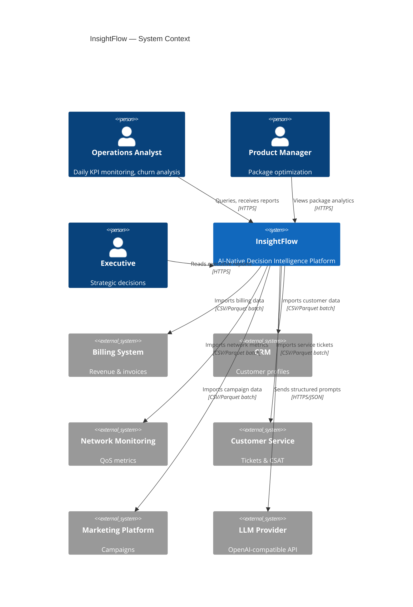
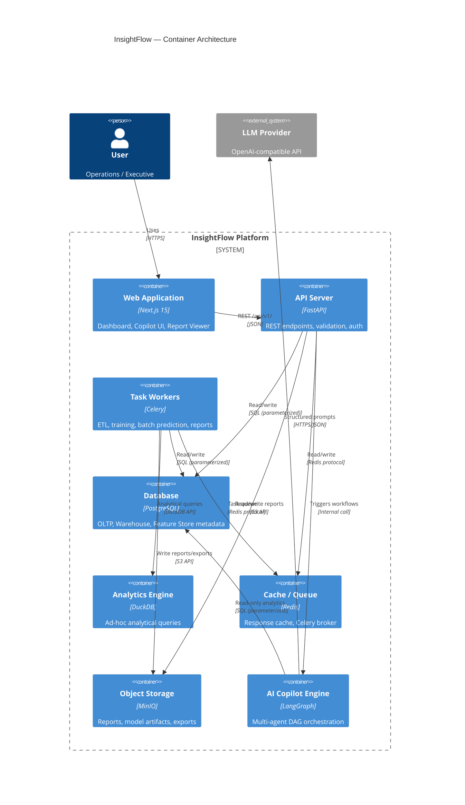
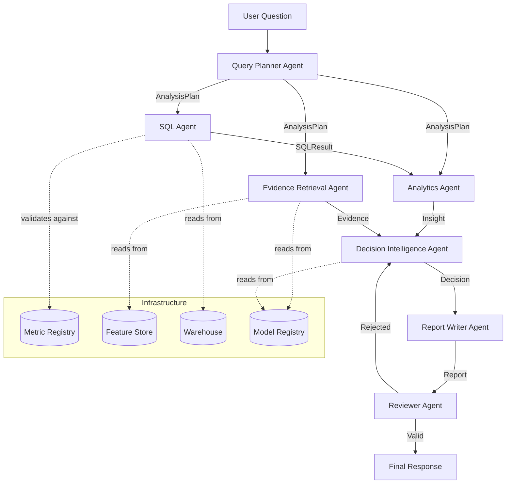
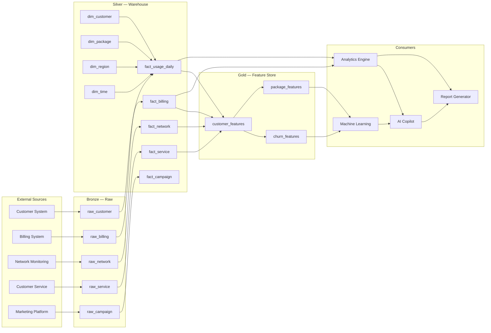

# InsightFlow — System Architecture

Version 1.0 · Status: **Frozen** · Target: **MVP**

---

## Table of Contents

1. [System Overview](#1-system-overview)
2. [Architecture Diagram](#2-architecture-diagram)
3. [Backend Architecture](#3-backend-architecture)
4. [AI Architecture](#4-ai-architecture)
5. [Data Architecture](#5-data-architecture)
6. [API Design](#6-api-design)
7. [Development Principles](#7-development-principles)

---

# 1. System Overview

## 1.1 Identity

InsightFlow is an **AI-Native Telecom Decision Intelligence Platform**. It transforms operational data from six telecom domains—Customer, Usage, Billing, Network, Customer Service, and Marketing—into evidence-backed business recommendations through a unified pipeline:

```
Raw Data → Warehouse → Feature Store → Analytics → ML → Decision Intelligence → AI Copilot → Report
```

## 1.2 Topology

| Component       | Technology           | Role                              |
| --------------- | -------------------- | --------------------------------- |
| Frontend        | Next.js 15 (App Router) | Presentation layer, zero business logic |
| Backend         | FastAPI + Python 3.12  | API, orchestration, domain logic  |
| OLTP / Warehouse | PostgreSQL           | Transactional data + Star Schema  |
| Local Analytics  | DuckDB               | Ad-hoc analytical queries, report generation |
| Cache / Queue    | Redis                | Response cache, Celery broker     |
| Object Storage   | MinIO (S3-compatible)| Generated reports, exported files, model artifacts |
| Task Queue       | Celery               | ETL, model training, batch prediction, report generation |
| AI Orchestration | LangGraph            | Multi-agent DAG execution         |
| LLM Provider     | OpenAI-compatible API| GPT-4o / DeepSeek / Qwen (pluggable) |

## 1.3 Principles

1. **Evidence First** — Every conclusion references verifiable data.
2. **Explainable AI** — Predictions include SHAP, confidence, and contributing factors.
3. **Human-in-the-Loop** — AI proposes; humans decide.
4. **Layered Architecture** — Dependencies point inward. No layer may be bypassed.
5. **Single Source of Truth** — One definition, one formula, one implementation per metric.
6. **Immutable Raw Data** — Bronze layer is append-only.

## 1.4 MVP Scope

Six capabilities in scope for V1.0:

- Customer 360
- KPI Dashboard (50+ standardized metrics)
- Customer Segmentation (KMeans, Gaussian Mixture)
- Churn Prediction (5 algorithms, SHAP explainability)
- Decision Intelligence (evidence-backed recommendations)
- AI Report Generation (Markdown, PDF)

Deferred to V1.5+: Recommendation Engine, What-if Simulation, Multi-tenant, RBAC, Streaming.

---

# 2. Architecture Diagram

## 2.1 System Context



## 2.2 Container Architecture



## 2.3 AI Copilot Agent Topology



## 2.4 Data Pipeline



---

# 3. Backend Architecture

## 3.1 Layer Stack

```
┌──────────────────────────────────────────┐
│  api/         FastAPI routers, middleware │  ← HTTP, validation, auth
├──────────────────────────────────────────┤
│  application/  Use cases, orchestration  │  ← coordinates domain services
├──────────────────────────────────────────┤
│  domain/       Entities, value objects,   │  ← business rules, ZERO deps
│                domain services, events    │
├──────────────────────────────────────────┤
│  infrastructure/ Repositories, Redis,     │  ← IO, external services
│                  storage, LLM client      │
└──────────────────────────────────────────┘
```

**Dependency rule**: `api → application → domain ← infrastructure`

`domain/` imports nothing from the other three layers. `infrastructure/` implements interfaces defined by `domain/`.

## 3.2 Project Structure

```
backend/
├── app/
│   ├── api/
│   │   ├── routers/           # One router per resource
│   │   │   ├── analytics.py
│   │   │   ├── customers.py
│   │   │   ├── packages.py
│   │   │   ├── churn.py
│   │   │   ├── copilot.py
│   │   │   ├── reports.py
│   │   │   ├── models.py
│   │   │   ├── recommendations.py
│   │   │   └── system.py
│   │   ├── dependencies/       # FastAPI Depends() factories
│   │   └── middleware/
│   │       ├── request_id.py
│   │       ├── logging.py
│   │       └── error_handler.py
│   │
│   ├── application/
│   │   ├── analytics/          # AnalyticsService, TrendService
│   │   ├── churn/              # ChurnPredictionService
│   │   ├── reports/            # ReportGenerationService
│   │   ├── copilot/            # CopilotOrchestrationService
│   │   └── recommendation/     # RecommendationService
│   │
│   ├── domain/
│   │   ├── customer/           # Customer aggregate, CustomerService
│   │   ├── package/            # Package entity
│   │   ├── billing/            # BillingRecord, RevenueCalculator
│   │   ├── network/            # NetworkMetric value object
│   │   ├── marketing/          # Campaign, CampaignResponse
│   │   ├── analytics/          # Insight, Evidence, MetricDefinition
│   │   ├── decision/           # Decision, Recommendation
│   │   ├── report/             # Report aggregate
│   │   └── shared/             # BaseEntity, DomainEvent, ValueObject
│   │
│   ├── infrastructure/
│   │   ├── database/           # session, engine, Alembic/
│   │   ├── repositories/       # CustomerRepo, ReportRepo, ModelRepo
│   │   ├── redis/              # cache client, queue client
│   │   ├── storage/            # MinIO adapter
│   │   ├── llm/                # LLM provider adapter
│   │   └── scheduler/          # Celery app, task definitions
│   │
│   ├── ai/                     # AI Copilot agents (see §4)
│   │   ├── planner/
│   │   ├── sql/
│   │   ├── analytics/
│   │   ├── retrieval/
│   │   ├── decision/
│   │   ├── writer/
│   │   └── reviewer/
│   │
│   ├── warehouse/              # ETL pipelines, data quality
│   ├── feature_store/          # Feature generation, versioning
│   ├── ml/                     # Training, evaluation, registry
│   │
│   ├── schemas/                # Pydantic API schemas (Request/Response)
│   ├── core/                   # config, exceptions, constants
│   └── tests/                  # mirrors app/ structure
│
├── alembic/                    # Database migrations
├── requirements.lock
└── pyproject.toml
```

## 3.3 Service Layer

Application services are **stateless orchestrators**. They never execute SQL or call HTTP endpoints directly.

```python
# Conceptual contract — not implementation
class ChurnPredictionService:
    """Orchestrates churn prediction workflow."""

    def __init__(
        self,
        customer_repo: CustomerRepository,
        feature_store: FeatureStore,
        model_registry: ModelRegistry,
        prediction_repo: PredictionRepository,
    ): ...

    async def predict_batch(self, dataset_version: str) -> BatchPredictionResult:
        """Load features → run model → persist predictions → return results."""
        ...

    async def predict_single(self, customer_id: str) -> ChurnPrediction:
        """Online prediction for a single customer."""
        ...

    async def explain_prediction(self, prediction_id: str) -> ShapExplanation:
        """Return SHAP values for a given prediction."""
        ...
```

## 3.4 Repository Layer

Repositories are the **sole entry point to persistence**. They return domain entities or DTOs — never ORM objects.

| Repository              | Responsibility                           |
| ----------------------- | ---------------------------------------- |
| `CustomerRepository`    | Customer CRUD, search, segmentation      |
| `PackageRepository`     | Package definitions                      |
| `BillingRepository`     | Billing fact reads (aggregated)          |
| `UsageRepository`       | Usage fact reads (time-series)           |
| `NetworkRepository`     | Network metric reads                     |
| `ServiceRepository`     | Service ticket reads                     |
| `CampaignRepository`    | Campaign & response data                 |
| `MetricRepository`      | Metric Registry — definitions only       |
| `FeatureRepository`     | Feature Store — feature values & metadata|
| `ModelRepository`       | Model Registry — versions, artifacts     |
| `PredictionRepository`  | Prediction results & explanations        |
| `ReportRepository`      | Generated reports & metadata             |
| `InsightRepository`     | Generated insights & evidence            |

### Interface Contract

```python
# Every repository follows this pattern
class CustomerRepository(ABC):
    """Domain-facing interface. Implemented by infrastructure/postgres."""

    @abstractmethod
    async def get_by_id(self, customer_id: str) -> Customer | None: ...

    @abstractmethod
    async def search(
        self,
        filters: CustomerFilters,
        page: int,
        page_size: int,
    ) -> PaginatedResult[Customer]: ...

    @abstractmethod
    async def list_high_risk(
        self,
        threshold: float,
        limit: int,
    ) -> list[Customer]: ...

    @abstractmethod
    async def get_segment_distribution(self) -> dict[str, int]: ...
```

## 3.5 Domain Layer

Domain is **framework-independent**. It imports nothing from FastAPI, SQLAlchemy, Redis, or LangGraph.

### Core Entities

| Entity           | Type      | Ownership |
| ---------------- | --------- | --------- |
| `Customer`       | Aggregate | Customer identity, lifecycle state, segment |
| `Package`        | Aggregate | Plan definition, pricing, features |
| `BillingRecord`  | Entity    | Monthly bill, discounts, payment status |
| `UsageRecord`    | Entity    | Daily voice/SMS/data consumption |
| `NetworkMetric`  | Value Object | Latency, drop rate, coverage score |
| `ServiceTicket`  | Entity    | Complaint type, resolution time, CSAT |
| `Campaign`       | Entity    | Promotion, channel, cost, conversion |
| `Insight`        | Value Object | Structured analytical finding |
| `Evidence`       | Value Object | Source table, SQL, sample size, confidence |
| `Decision`       | Aggregate | Finding + impact + recommendation + confidence |
| `Recommendation` | Value Object | Action, expected revenue, expected retention |
| `Report`         | Aggregate | Type, format, generation status, sections |

### State Transitions

```
Customer:  Prospect → Active → At-Risk → Churned
                         ↓
                       Premium → Retained

Report:    Draft → Generating → Completed → Published
                      ↓
                    Failed (retryable)

ML Model:  Development → Staging → Production → Archived
```

## 3.6 Cross-Cutting Concerns

Every layer implements these uniformly:

| Concern        | Mechanism                              |
| -------------- | -------------------------------------- |
| Logging        | Structured JSON; `structlog`           |
| Tracing        | `request_id`, `workflow_id`, `correlation_id` |
| Error Handling | Typed exceptions → standard HTTP responses |
| Configuration  | Environment variables via `pydantic-settings` |
| Validation     | Pydantic v2 at API boundary            |
| Type Safety    | `mypy` strict; all public interfaces typed |

### Standard Error Response

```json
{
    "success": false,
    "error": {
        "code": "MODEL_NOT_FOUND",
        "message": "Requested model version v3.1.0 does not exist in the registry.",
        "details": null
    },
    "request_id": "req_01J2X5K8N3P7Q9R2"
}
```

Error categories: `VALIDATION`, `BUSINESS`, `INFRASTRUCTURE`, `EXTERNAL_SERVICE`, `INTERNAL`.

---

# 4. AI Architecture

## 4.1 LLM Abstraction

The platform is provider-agnostic. All LLM access passes through a single adapter:

```python
class LLMProvider(ABC):
    """Abstract interface for LLM backends."""

    @abstractmethod
    async def complete(
        self,
        prompt: Prompt,
        model: str | None = None,
        temperature: float = 0.0,
        json_mode: bool = False,
    ) -> LLMResponse: ...

    @abstractmethod
    async def complete_structured(
        self,
        prompt: Prompt,
        output_schema: type[T],
        model: str | None = None,
    ) -> T: ...
```

**Supported providers** (configured via `LLM_PROVIDER` env var):
- `openai` — GPT-4o, GPT-4o-mini
- `deepseek` — DeepSeek-V3, DeepSeek-R1
- `qwen` — Qwen-Max (via DashScope)
- `vllm` — Self-hosted (OpenAI-compatible endpoint)

Switching providers is a configuration change, not a code change.

## 4.2 Prompt Management

Prompts are **versioned assets**, not inline strings.

### Storage

```
backend/app/ai/prompts/
├── planner/
│   ├── v1__intent_extraction.yaml
│   ├── v1__plan_generation.yaml
│   └── v2__plan_generation.yaml      # v2 supersedes v1
├── sql/
│   └── v1__sql_generation.yaml
├── decision/
│   └── v1__decision_synthesis.yaml
├── writer/
│   └── v1__report_generation.yaml
└── reviewer/
    └── v1__output_validation.yaml
```

### Prompt Schema

```yaml
# v1__sql_generation.yaml
version: "1.0.0"
purpose: "Generate parameterized read-only SQL from an AnalysisPlan"
model: "gpt-4o"
temperature: 0.0
json_mode: true
input_variables:
  - metric_definitions
  - table_schema
  - analysis_plan
  - user_question
system: |
  You are a SQL generator for a telecom analytics platform.
  Rules:
  - Generate ONLY SELECT statements.
  - Never produce INSERT, UPDATE, DELETE, DDL, or DCL.
  - Use parameterized placeholders ($1, $2) for user-supplied values.
  - Validate column names against the provided schema.
  - If a requested metric is not in the schema, return an error.

  Available tables and columns:
  {table_schema}

  Metric definitions:
  {metric_definitions}

  Analysis plan:
  {analysis_plan}
user: |
  Original question: {user_question}

  Generate the SQL query. Return JSON with keys: "sql", "tables_used", "confidence".
output_schema:
  type: object
  properties:
    sql: { type: string }
    tables_used: { type: array, items: { type: string } }
    confidence: { type: number, minimum: 0, maximum: 1 }
  required: [sql, tables_used, confidence]
```

### Prompt Lifecycle

```
Draft → Review → Registered → Active → Deprecated → Archived
```

Prompt changes require:
1. Version bump
2. Regression test against golden datasets
3. Evaluation score comparison with previous version
4. ADR if behavior changes significantly

## 4.3 Agent Architecture

Each agent is an independent, stateless, single-responsibility service. Agents communicate through **typed domain objects**, never raw text.

### Agent Registry

| Agent                      | Responsibility                    | Input → Output                    |
| -------------------------- | --------------------------------- | --------------------------------- |
| **Query Planner Agent**    | NLU → AnalysisPlan               | `str` → `AnalysisPlan`           |
| **SQL Agent**              | AnalysisPlan → parameterized SQL  | `AnalysisPlan` → `SQLResult`     |
| **Analytics Agent**        | SQLResult → Insight[]             | `SQLResult` → `list[Insight]`    |
| **Evidence Retrieval Agent** | Collect supporting data         | `AnalysisPlan` → `list[Evidence]`|
| **Decision Intelligence Agent** | Insights + Evidence + ML → Decision | `Insight[], Evidence[], Prediction` → `Decision` |
| **Report Writer Agent**    | Decision → structured report      | `Decision` → `Report`            |
| **Reviewer Agent**         | Validate completeness & consistency | `Report` → `ReviewResult`       |

### Agent Contract

```python
class Agent(ABC, Generic[TInput, TOutput]):
    """Base contract for every AI agent."""

    agent_id: str
    prompt_version: str
    llm: LLMProvider

    @abstractmethod
    async def execute(
        self,
        input: TInput,
        context: WorkflowContext,
    ) -> AgentResult[TOutput]: ...

    def trace(self) -> AgentTrace:
        """Return execution_id, latency, input, output, errors."""
        ...
```

### Execution Guarantees

Every agent execution produces:

| Field          | Purpose                                       |
| -------------- | --------------------------------------------- |
| `execution_id` | Unique per invocation                         |
| `start_time`   | ISO 8601                                      |
| `end_time`     | ISO 8601                                      |
| `latency_ms`   | Wall-clock duration                           |
| `input`        | Serialized input snapshot                     |
| `output`       | Serialized output or error                    |
| `prompt_version` | Which prompt was used                      |
| `model`        | Which LLM model was called                    |
| `token_usage`  | prompt_tokens, completion_tokens              |
| `error`        | null on success                               |

## 4.4 Workflow Engine (LangGraph)

The AI Copilot executes as a **Directed Acyclic Graph (DAG)** via LangGraph's `StateGraph`.

### Workflow State

```python
class WorkflowState(TypedDict):
    """Shared state across all agents in one workflow execution."""

    # Input
    user_question: str
    workflow_id: str

    # Planner output
    business_intent: str | None
    analysis_plan: AnalysisPlan | None

    # SQL Agent output
    generated_sql: str | None
    sql_result: SQLResult | None
    sql_error: str | None

    # Analytics Agent output
    insights: list[Insight]

    # Evidence Retrieval output
    evidence_items: list[Evidence]

    # Decision Intelligence output
    decision: Decision | None

    # Writer output
    report: Report | None

    # Reviewer output
    review_passed: bool
    review_feedback: str | None
    retry_count: int  # max 3

    # Tracing
    agent_traces: list[AgentTrace]
    error_log: list[str]
```

### DAG Definition

```python
from langgraph.graph import StateGraph, END

def build_copilot_graph() -> StateGraph:
    graph = StateGraph(WorkflowState)

    graph.add_node("planner", run_planner_agent)
    graph.add_node("sql", run_sql_agent)
    graph.add_node("analytics", run_analytics_agent)
    graph.add_node("evidence", run_evidence_agent)
    graph.add_node("decision", run_decision_agent)
    graph.add_node("writer", run_writer_agent)
    graph.add_node("reviewer", run_reviewer_agent)

    graph.set_entry_point("planner")
    graph.add_edge("planner", "sql")
    graph.add_edge("planner", "evidence")    # parallel with sql
    graph.add_edge("sql", "analytics")
    graph.add_edge("analytics", "decision")
    graph.add_edge("evidence", "decision")
    graph.add_edge("decision", "writer")
    graph.add_edge("writer", "reviewer")

    # Reviewer gate: retry up to 3 times, then force through
    graph.add_conditional_edges(
        "reviewer",
        decide_next,
        {
            "writer": "writer",     # retry
            END: END,               # pass
        },
    )

    return graph
```

### Key Design Decisions

**Retry ceiling**: Reviewer can reject at most **3 times**. On the 4th attempt the output is delivered with `confidence: low` and `review_override: true`. This prevents infinite loops while preserving auditability.

**Parallel execution**: SQL Agent and Evidence Retrieval Agent run **concurrently** since they share no data dependency. This saves ~2–3 seconds per workflow.

## 4.5 Memory

The Copilot is **stateless per request**. All context is assembled dynamically:

```
User Question
    +
Relevant Metric Definitions    (from Metric Registry)
Relevant Warehouse Schema      (from information_schema)
Recent KPIs                    (from Semantic Layer cache)
Customer Features (if targeted)(from Feature Store)
Model Explanations (if ML)     (from Prediction Repository)
Historical Reports (if similar)(from Report Repository)
    ↓
Context Assembly (max 8K tokens)
    ↓
LLM Prompt
```

Long-term "memory" (cross-session) is explicitly deferred to V2.0 (RAG + Knowledge Graph). MVP treats every question independently.

## 4.6 Evaluation

### Prompt Evaluation

Every prompt version is evaluated on a golden dataset before activation:

```python
class PromptEvaluator:
    def evaluate(
        self,
        prompt: Prompt,
        test_cases: list[TestCase],
    ) -> EvaluationReport:
        """
        For each test case:
        1. Run prompt → get output
        2. Compare against expected output
        3. Compute: exact_match, semantic_similarity, schema_validity
        """
        ...
```

### Agent Evaluation

Each agent type has dedicated evaluation metrics:

| Agent       | Primary Metric        | Threshold |
| ----------- | --------------------- | --------- |
| Planner     | Intent accuracy       | ≥ 0.90    |
| SQL Agent   | SQL validity rate     | ≥ 0.95    |
| Decision    | Evidence alignment    | ≥ 0.85    |
| Reviewer    | False pass rate       | ≤ 0.05    |

### Guardrails

- **SQL Execution Sandbox**: All AI-generated SQL runs in a read-only transaction with a 5-second timeout. `DROP`, `DELETE`, `INSERT`, `UPDATE`, `TRUNCATE`, `ALTER` are rejected at the parser level before execution.
- **Output Schema Validation**: Agent outputs that declare a `json_mode` schema are validated with Pydantic before entering the domain layer.
- **Confidence Threshold**: Decisions with `confidence < 0.6` are flagged "low confidence — human review required" in the final report.

---

# 5. Data Architecture

## 5.1 Layer Model

| Layer           | PostgreSQL Schema | Rules                                  |
| --------------- | ----------------- | -------------------------------------- |
| **Bronze (Raw)**  | `raw`             | Append-only, no transformation, unlimited retention |
| **Silver (Warehouse)** | `warehouse`       | Validated, normalized, Star Schema     |
| **Gold (Feature Store)** | `feature_store`   | Versioned features, ML-only access     |
| **Semantic**      | `semantic`        | Materialized KPI views, API/dashboard access |

## 5.2 Star Schema

### Fact Tables

```sql
-- warehouse.fact_usage_daily
CREATE TABLE warehouse.fact_usage_daily (
    usage_id        BIGSERIAL PRIMARY KEY,
    customer_id     INTEGER NOT NULL,
    package_id      INTEGER NOT NULL,
    region_id       INTEGER NOT NULL,
    date_id         INTEGER NOT NULL,       -- FK → dim_time
    voice_minutes   DECIMAL(10,2),
    sms_count       INTEGER,
    data_usage_mb   DECIMAL(12,2),
    roaming_usage_mb DECIMAL(10,2),
    peak_usage_mb   DECIMAL(10,2),
    international_minutes DECIMAL(8,2),
    created_at      TIMESTAMPTZ DEFAULT now(),

    FOREIGN KEY (customer_id) REFERENCES warehouse.dim_customer(customer_id),
    FOREIGN KEY (package_id)  REFERENCES warehouse.dim_package(package_id),
    FOREIGN KEY (region_id)   REFERENCES warehouse.dim_region(region_id),
    FOREIGN KEY (date_id)     REFERENCES warehouse.dim_time(date_id)
);

CREATE INDEX idx_fact_usage_customer ON warehouse.fact_usage_daily(customer_id, date_id);
CREATE INDEX idx_fact_usage_date    ON warehouse.fact_usage_daily(date_id);
CREATE INDEX idx_fact_usage_package ON warehouse.fact_usage_daily(package_id, date_id);

-- warehouse.fact_billing
CREATE TABLE warehouse.fact_billing (
    billing_id      BIGSERIAL PRIMARY KEY,
    customer_id     INTEGER NOT NULL,
    package_id      INTEGER NOT NULL,
    date_id         INTEGER NOT NULL,
    billing_month   DATE NOT NULL,
    monthly_fee     DECIMAL(10,2),
    discount_amount DECIMAL(10,2),
    payment_status  VARCHAR(20),          -- 'paid', 'overdue', 'pending'
    overdue_days    INTEGER,
    package_price   DECIMAL(10,2),

    FOREIGN KEY (customer_id) REFERENCES warehouse.dim_customer(customer_id),
    FOREIGN KEY (package_id)  REFERENCES warehouse.dim_package(package_id),
    FOREIGN KEY (date_id)     REFERENCES warehouse.dim_time(date_id)
);

CREATE INDEX idx_fact_billing_customer ON warehouse.fact_billing(customer_id, billing_month);
CREATE INDEX idx_fact_billing_month    ON warehouse.fact_billing(billing_month);

-- warehouse.fact_network
CREATE TABLE warehouse.fact_network (
    network_id      BIGSERIAL PRIMARY KEY,
    customer_id     INTEGER NOT NULL,
    region_id       INTEGER NOT NULL,
    date_id         INTEGER NOT NULL,
    latency_ms      DECIMAL(8,2),
    signal_strength DECIMAL(5,2),
    drop_rate       DECIMAL(5,4),         -- 0.0000 to 1.0000
    packet_loss     DECIMAL(5,4),
    coverage_score  DECIMAL(5,2),

    FOREIGN KEY (customer_id) REFERENCES warehouse.dim_customer(customer_id),
    FOREIGN KEY (region_id)   REFERENCES warehouse.dim_region(region_id),
    FOREIGN KEY (date_id)     REFERENCES warehouse.dim_time(date_id)
);

CREATE INDEX idx_fact_network_customer ON warehouse.fact_network(customer_id, date_id);

-- warehouse.fact_service
CREATE TABLE warehouse.fact_service (
    service_id      BIGSERIAL PRIMARY KEY,
    customer_id     INTEGER NOT NULL,
    date_id         INTEGER NOT NULL,
    ticket_count    INTEGER,
    complaint_type  VARCHAR(50),
    waiting_time_min DECIMAL(8,2),
    resolution_time_min DECIMAL(8,2),
    csat_score      INTEGER CHECK (csat_score BETWEEN 1 AND 5),

    FOREIGN KEY (customer_id) REFERENCES warehouse.dim_customer(customer_id),
    FOREIGN KEY (date_id)     REFERENCES warehouse.dim_time(date_id)
);

CREATE INDEX idx_fact_service_customer ON warehouse.fact_service(customer_id, date_id);

-- warehouse.fact_campaign
CREATE TABLE warehouse.fact_campaign (
    campaign_response_id BIGSERIAL PRIMARY KEY,
    customer_id     INTEGER NOT NULL,
    campaign_id     INTEGER NOT NULL,
    date_id         INTEGER NOT NULL,
    promotion_type  VARCHAR(50),
    coupon_used     BOOLEAN,
    converted       BOOLEAN,
    channel         VARCHAR(30),
    campaign_cost   DECIMAL(10,2),

    FOREIGN KEY (customer_id) REFERENCES warehouse.dim_customer(customer_id),
    FOREIGN KEY (date_id)     REFERENCES warehouse.dim_time(date_id)
);

CREATE INDEX idx_fact_campaign_customer ON warehouse.fact_campaign(customer_id, date_id);
```

### Dimension Tables

```sql
-- warehouse.dim_customer (SCD Type 1 for MVP)
CREATE TABLE warehouse.dim_customer (
    customer_id     INTEGER PRIMARY KEY,
    gender          VARCHAR(10),
    age             INTEGER CHECK (age >= 0),
    city            VARCHAR(100),
    region_id       INTEGER,
    join_date       DATE NOT NULL,
    contract_type   VARCHAR(30),         -- 'prepaid', 'postpaid', 'hybrid'
    package_id      INTEGER,
    status          VARCHAR(20),         -- 'active', 'suspended', 'churned'
    lifecycle_stage VARCHAR(30),         -- 'new', 'active', 'at_risk', 'churned'
    segment         VARCHAR(50),         -- populated by ML segmentation
    clv             DECIMAL(12,2),
    created_at      TIMESTAMPTZ DEFAULT now(),
    updated_at      TIMESTAMPTZ DEFAULT now(),

    FOREIGN KEY (region_id)  REFERENCES warehouse.dim_region(region_id),
    FOREIGN KEY (package_id) REFERENCES warehouse.dim_package(package_id)
);

CREATE INDEX idx_dim_customer_status ON warehouse.dim_customer(status);
CREATE INDEX idx_dim_customer_segment ON warehouse.dim_customer(segment);

-- warehouse.dim_package
CREATE TABLE warehouse.dim_package (
    package_id      INTEGER PRIMARY KEY,
    package_name    VARCHAR(100) NOT NULL,
    package_type    VARCHAR(30),         -- 'voice', 'data', 'bundle', 'premium'
    monthly_price   DECIMAL(10,2),
    data_quota_gb   DECIMAL(8,2),
    voice_quota_min INTEGER,
    sms_quota       INTEGER,
    is_active       BOOLEAN DEFAULT true
);

-- warehouse.dim_region
CREATE TABLE warehouse.dim_region (
    region_id       INTEGER PRIMARY KEY,
    region_name     VARCHAR(100) NOT NULL,
    province        VARCHAR(100),
    city_tier       VARCHAR(10)           -- 'T1', 'T2', 'T3'
);

-- warehouse.dim_time
CREATE TABLE warehouse.dim_time (
    date_id         INTEGER PRIMARY KEY,  -- YYYYMMDD
    full_date       DATE NOT NULL,
    year            SMALLINT,
    quarter         SMALLINT,
    month           SMALLINT,
    week            SMALLINT,
    day             SMALLINT,
    day_of_week     SMALLINT,
    is_weekend      BOOLEAN,
    fiscal_year     SMALLINT,
    fiscal_quarter  SMALLINT
);
```

## 5.3 Feature Store Schema

MVP implements the Feature Store as PostgreSQL tables with version metadata. Each feature table is a **wide table** (one row per customer).

```sql
-- feature_store.customer_features
CREATE TABLE feature_store.customer_features (
    customer_id         INTEGER PRIMARY KEY,
    feature_version     VARCHAR(20) NOT NULL,   -- 'v1.0.0'
    generated_at        TIMESTAMPTZ DEFAULT now(),

    -- Customer features
    tenure_days         INTEGER,
    customer_age        INTEGER,
    contract_duration   INTEGER,

    -- Usage features
    avg_daily_data_mb   DECIMAL(10,2),
    weekend_usage_ratio DECIMAL(5,4),
    night_usage_ratio   DECIMAL(5,4),
    peak_usage_ratio    DECIMAL(5,4),
    usage_growth_rate   DECIMAL(6,4),

    -- Billing features
    arpu                DECIMAL(10,2),
    discount_ratio      DECIMAL(5,4),
    payment_delay_avg   DECIMAL(6,2),
    recharge_interval   DECIMAL(6,2),

    -- Service features
    complaint_frequency DECIMAL(6,4),
    avg_resolution_time DECIMAL(8,2),
    csat_avg            DECIMAL(4,2),
    escalation_count    INTEGER,

    -- Network features
    drop_rate_avg       DECIMAL(5,4),
    latency_avg_ms      DECIMAL(8,2),
    coverage_score_avg  DECIMAL(5,2),
    signal_stability    DECIMAL(5,4),

    -- Behavioral features
    package_upgrade_count   INTEGER,
    promotion_response_rate DECIMAL(5,4),
    recharge_frequency      DECIMAL(6,2),
    downgrade_risk_score    DECIMAL(5,4)
);

CREATE INDEX idx_cf_version ON feature_store.customer_features(feature_version);
CREATE INDEX idx_cf_arpu    ON feature_store.customer_features(arpu);
CREATE INDEX idx_cf_tenure  ON feature_store.customer_features(tenure_days);

-- Feature metadata
CREATE TABLE feature_store.feature_registry (
    feature_id      SERIAL PRIMARY KEY,
    feature_name    VARCHAR(100) NOT NULL UNIQUE,
    description     TEXT,
    formula         TEXT,
    data_source     VARCHAR(200),
    data_type       VARCHAR(20),
    refresh_cron    VARCHAR(50),
    version         VARCHAR(20) NOT NULL,
    owner           VARCHAR(100),
    is_deprecated   BOOLEAN DEFAULT false,
    created_at      TIMESTAMPTZ DEFAULT now()
);
```

## 5.4 Model Registry Schema

```sql
-- ml.model_registry
CREATE TABLE ml.model_registry (
    model_id            SERIAL PRIMARY KEY,
    model_name          VARCHAR(100) NOT NULL,
    model_version       VARCHAR(20) NOT NULL,
    model_type          VARCHAR(30),        -- 'churn_prediction', 'segmentation', 'revenue_forecast'
    algorithm           VARCHAR(50),        -- 'xgboost', 'lightgbm', 'random_forest'
    artifact_path       VARCHAR(500),       -- MinIO object key
    training_dataset_id VARCHAR(100),
    feature_version     VARCHAR(20),
    evaluation_report   JSONB,              -- precision, recall, f1, roc_auc, etc.
    hyperparameters     JSONB,
    random_seed         INTEGER,
    training_time_sec   INTEGER,
    framework_version   VARCHAR(30),
    status              VARCHAR(20) DEFAULT 'development',  -- development, staging, production, archived
    promoted_at         TIMESTAMPTZ,
    created_at          TIMESTAMPTZ DEFAULT now(),

    UNIQUE(model_name, model_version)
);
```

## 5.5 Metric Registry Schema

```sql
-- semantic.metric_registry
CREATE TABLE semantic.metric_registry (
    metric_id       SERIAL PRIMARY KEY,
    metric_name     VARCHAR(100) NOT NULL UNIQUE,
    category        VARCHAR(50),           -- 'revenue', 'customer', 'usage', 'network', 'service', 'marketing'
    business_definition TEXT NOT NULL,
    formula         TEXT NOT NULL,
    unit            VARCHAR(30),
    data_source     VARCHAR(200),
    refresh_cron    VARCHAR(50),
    owner           VARCHAR(100),
    version         VARCHAR(20) NOT NULL,
    is_deprecated   BOOLEAN DEFAULT false,
    created_at      TIMESTAMPTZ DEFAULT now()
);
```

## 5.6 Semantic Layer (Materialized Views)

```sql
-- semantic.kpi_arpu
CREATE MATERIALIZED VIEW semantic.kpi_arpu AS
SELECT
    dt.year,
    dt.month,
    dr.region_name,
    SUM(fb.monthly_fee - fb.discount_amount)
        / COUNT(DISTINCT fb.customer_id) AS arpu
FROM warehouse.fact_billing fb
JOIN warehouse.dim_time dt   ON fb.date_id = dt.date_id
JOIN warehouse.dim_customer dc ON fb.customer_id = dc.customer_id
JOIN warehouse.dim_region dr  ON dc.region_id = dr.region_id
WHERE dc.status = 'active'
GROUP BY dt.year, dt.month, dr.region_name;

CREATE UNIQUE INDEX idx_kpi_arpu ON semantic.kpi_arpu(year, month, region_name);
```

## 5.7 Index Strategy

| Table                          | Index                                 | Purpose                        |
| ------------------------------ | ------------------------------------- | ------------------------------ |
| `fact_usage_daily`             | `(customer_id, date_id)`              | Customer time-series queries   |
| `fact_usage_daily`             | `(date_id)`                           | Daily aggregation              |
| `fact_billing`                 | `(customer_id, billing_month)`        | Customer billing history       |
| `fact_billing`                 | `(billing_month)`                     | Monthly revenue rollup         |
| `fact_network`                 | `(customer_id, date_id)`              | Customer network trends        |
| `fact_service`                 | `(customer_id, date_id)`              | Customer complaint history     |
| `dim_customer`                 | `(status)`                            | Active/churned filtering       |
| `dim_customer`                 | `(segment)`                           | Segment-based queries          |
| `customer_features`            | `(feature_version)`                   | Feature version filtering      |
| `customer_features`            | `(arpu)`, `(tenure_days)`             | Common filter columns          |

## 5.8 Storage Summary

| Storage        | Technology | Contents                                | Size Est. (1M customers) |
| -------------- | ---------- | --------------------------------------- | ------------------------ |
| PostgreSQL     | RDS/Local  | Bronze, Silver, Gold, Semantic, Registry | ~5 GB                    |
| DuckDB         | File       | Temporary analytical copies              | ~1 GB (ephemeral)        |
| Redis          | ElastiCache| KPI cache, Celery broker                 | ~500 MB                  |
| MinIO          | S3-compat  | Reports (PDF/MD), model artifacts        | ~10 GB                   |

---

# 6. API Design

## 6.1 Conventions

| Rule                    | Example                                    |
| ----------------------- | ------------------------------------------ |
| Base path               | `/api/v1/`                                 |
| Plural resources        | `/customers`, `/reports`                   |
| snake_case JSON keys    | `"risk_score"`, `"created_at"`             |
| ISO 8601 timestamps     | `"2026-08-15T10:30:00Z"`                  |
| Pagination              | `?page=1&page_size=20`                    |
| Sorting                 | `?sort=created_at&order=desc`              |
| Filtering               | `?status=active&segment=premium`           |

## 6.2 Standard Response Envelope

**Success:**
```json
{
    "success": true,
    "data": { ... },
    "meta": {
        "page": 1,
        "page_size": 20,
        "total": 1523
    },
    "request_id": "req_01J2X5K8N3P7Q9R2"
}
```

**Error:**
```json
{
    "success": false,
    "error": {
        "code": "CUSTOMER_NOT_FOUND",
        "message": "Customer with ID 99999 does not exist.",
        "details": null
    },
    "request_id": "req_01J2X5K8N3P7Q9R2"
}
```

## 6.3 API Modules & Endpoints

### Analytics

| Method | Path                              | Description                           |
| ------ | --------------------------------- | ------------------------------------- |
| GET    | `/api/v1/analytics/kpi`           | List KPI values (filterable)          |
| GET    | `/api/v1/analytics/kpi/{metric}`  | Single metric trend                   |
| GET    | `/api/v1/analytics/trend`         | Trend analysis for a metric           |
| GET    | `/api/v1/analytics/anomaly`       | List active anomalies                 |
| GET    | `/api/v1/analytics/segmentation`  | Segment distribution for a metric     |
| GET    | `/api/v1/analytics/funnel`        | Customer lifecycle funnel             |
| GET    | `/api/v1/analytics/cohort`        | Retention by cohort                   |

### Customers

| Method | Path                                  | Description                       |
| ------ | ------------------------------------- | --------------------------------- |
| GET    | `/api/v1/customers`                   | List/search customers (paginated) |
| GET    | `/api/v1/customers/{id}`              | Customer 360 profile              |
| GET    | `/api/v1/customers/{id}/usage`        | Usage history                     |
| GET    | `/api/v1/customers/{id}/billing`      | Billing history                   |
| GET    | `/api/v1/customers/{id}/predictions`  | Churn risk & model explanations   |
| GET    | `/api/v1/customers/{id}/timeline`     | Customer journey events           |

### Churn

| Method | Path                                  | Description                         |
| ------ | ------------------------------------- | ----------------------------------- |
| GET    | `/api/v1/churn/overview`              | Churn rate, trend, risk distribution|
| POST   | `/api/v1/churn/predict`               | Single customer churn prediction    |
| POST   | `/api/v1/churn/predict/batch`         | Trigger batch prediction (async)    |
| GET    | `/api/v1/churn/predictions/{id}`      | Prediction detail with SHAP         |

### Reports

| Method | Path                                  | Description                     |
| ------ | ------------------------------------- | ------------------------------- |
| GET    | `/api/v1/reports`                     | List generated reports          |
| POST   | `/api/v1/reports/generate`            | Trigger report generation (async)|
| GET    | `/api/v1/reports/{id}`                | Report metadata & download URL  |
| GET    | `/api/v1/reports/{id}/download`       | Download report file            |

### AI Copilot

| Method | Path                                  | Description                     |
| ------ | ------------------------------------- | ------------------------------- |
| POST   | `/api/v1/copilot/chat`                | Submit question, get full response|
| GET    | `/api/v1/copilot/workflows/{id}`      | Workflow execution trace        |
| GET    | `/api/v1/copilot/history`             | Chat history (paginated)        |

### Models

| Method | Path                                  | Description                     |
| ------ | ------------------------------------- | ------------------------------- |
| GET    | `/api/v1/models`                      | List registered models          |
| GET    | `/api/v1/models/{id}`                 | Model detail + evaluation report|
| POST   | `/api/v1/models/{id}/promote`         | Promote model to production     |

### Features

| Method | Path                                  | Description                     |
| ------ | ------------------------------------- | ------------------------------- |
| GET    | `/api/v1/features`                    | List registered features        |
| GET    | `/api/v1/features/{name}`             | Feature detail & metadata       |

### System

| Method | Path                                  | Description                     |
| ------ | ------------------------------------- | ------------------------------- |
| GET    | `/api/v1/system/health`               | Health check                    |
| GET    | `/api/v1/system/metrics`              | Internal observability metrics  |

## 6.4 Key Request/Response Examples

### POST /api/v1/copilot/chat

**Request:**
```json
{
    "question": "Why did churn increase in East Region last month?",
    "context": {
        "time_range": "2026-07",
        "region": "East"
    }
}
```

**Response:**
```json
{
    "success": true,
    "data": {
        "workflow_id": "wf_01J2X6M1N4Q8R3S5",
        "intent": "churn_root_cause_analysis",
        "findings": [
            {
                "title": "Premium customer churn increased 23% MoM in East Region",
                "confidence": 0.92,
                "evidence": [
                    {
                        "source": "fact_service",
                        "description": "Complaint volume +28% among premium customers",
                        "sample_size": 45210
                    },
                    {
                        "source": "fact_network",
                        "description": "Average latency increased from 35ms to 62ms",
                        "sample_size": 182000
                    }
                ]
            }
        ],
        "recommendations": [
            {
                "action": "Prioritize network optimization in East Region urban clusters",
                "expected_impact": "Estimated 3-5% churn reduction within 60 days",
                "confidence": 0.87
            }
        ],
        "generated_sql": "SELECT region, COUNT(*) ... (for audit)",
        "report_id": "rpt_01J2X6M1N4Q8R3S5"
    },
    "meta": {
        "latency_ms": 8200,
        "agents_executed": 7,
        "model": "gpt-4o"
    },
    "request_id": "req_01J2X6M1N4Q8R3S5"
}
```

### POST /api/v1/churn/predict

**Request:**
```json
{
    "customer_id": "CUST-10025"
}
```

**Response:**
```json
{
    "success": true,
    "data": {
        "customer_id": "CUST-10025",
        "risk_score": 0.91,
        "risk_level": "HIGH",
        "top_positive_factors": [
            {"feature": "complaint_frequency", "contribution": 0.32},
            {"feature": "payment_delay_avg", "contribution": 0.21}
        ],
        "top_negative_factors": [
            {"feature": "tenure_days", "contribution": -0.08}
        ],
        "confidence": 0.93,
        "model_version": "churn_xgboost_v1.2.0",
        "shap_waterfall_url": "/api/v1/churn/predictions/pred_001/shap"
    },
    "request_id": "req_01J2X6M1N4Q8R3S6"
}
```

## 6.5 Error Handling

All errors map to typed HTTP responses:

| Error Category       | HTTP Status | Example Code                  |
| ---------------------| ----------- | ----------------------------- |
| Validation           | 422         | `INVALID_DATE_RANGE`          |
| Business             | 409         | `REPORT_ALREADY_PUBLISHED`    |
| Not Found            | 404         | `CUSTOMER_NOT_FOUND`          |
| Infrastructure       | 503         | `DATABASE_UNAVAILABLE`        |
| External Service     | 502         | `LLM_PROVIDER_TIMEOUT`        |
| Internal             | 500         | `INTERNAL_ERROR`              |

Rate limiting: 429 with `Retry-After` header. Authentication failure: 401. Authorization failure: 403.

---

# 7. Development Principles

## 7.1 Architecture Compliance

Every code change must satisfy the immutable Architecture Rules defined in the project's Architecture Freeze document. No PR may be merged if it:

- Places business logic in API routers or React components.
- Accesses the database outside a Repository.
- Creates a metric calculation that duplicates an existing Metric Registry entry.
- Returns an ORM object through an API endpoint.
- Hardcodes configuration values or secrets.

When a rule must be broken, an **Architecture Decision Record (ADR)** must be written and approved before the violation enters `main`.

## 7.2 Clean Architecture

```
Presentation  →  Application  →  Domain  ←  Infrastructure
```

- **Domain layer** contains zero framework imports. It defines interfaces; infrastructure implements them.
- **Repository Pattern** is the universal persistence boundary. No service writes SQL.
- **Dependency Injection** is mandatory. Services receive their dependencies through constructors — they never instantiate infrastructure objects.

## 7.3 Evidence-Driven Development

Every feature that produces business output must answer:

1. **What is the finding?** — structured, not prose.
2. **What is the evidence?** — source table, SQL, sample size, confidence.
3. **Can this be reproduced?** — same inputs must produce the same output.

Features that cannot satisfy these three questions are not complete.

## 7.4 Test-Driven Development

| Layer             | Test Type        | Target  |
| ----------------- | ---------------- | ------- |
| Domain            | Unit             | ≥ 90%   |
| Application       | Unit + Integration | ≥ 85% |
| Infrastructure    | Integration       | ≥ 80%   |
| API               | Integration + E2E | ≥ 80%   |
| AI Agents         | Prompt Regression | ≥ 90%   |
| **Total**         | —                | **≥ 80%** |

AI Agent testing includes:

- **Golden dataset tests**: fixed inputs → expected structured outputs.
- **Schema validity tests**: agent output passes Pydantic validation.
- **Safety tests**: SQL Agent rejects DDL, INSERT, UPDATE, DELETE.
- **Reviewer tests**: known-bad reports are correctly rejected.

## 7.5 Observability First

Every request through the system generates:

```
request_id → workflow_id → agent_execution_id → sql_query_id
```

This trace chain must be preserved through async boundaries (Celery tasks, LangGraph nodes). All logs are structured JSON and include the trace identifiers. Dashboard latency, AI Copilot latency, and model prediction latency are exported as Prometheus metrics.

## 7.6 Human-in-the-Loop

The platform is a **decision support system**, not an autonomous operator:

- AI-generated recommendations have confidence scores. Low-confidence outputs are explicitly flagged.
- Reports include a "Reviewer Assessment" section when the Reviewer Agent overrides or flags content.
- Batch predictions can be reviewed before downstream actions are triggered.
- The product never executes business operations (sending campaigns, modifying accounts) automatically.

## 7.7 Modular by Default

Each domain module (`customer/`, `billing/`, `analytics/`, `decision/`, etc.) is designed to become an independently deployable service in Phase 3. To enable this:

- Module boundaries are enforced at the import level (no cross-domain direct imports).
- Modules communicate through DTOs, not ORM objects.
- Configuration is per-module, not global.
- Each module owns its own database migrations within its schema.

## 7.8 AI Engineering Standards

- **Prompt versioning**: Every prompt is a versioned YAML asset with a defined evaluation score.
- **LLM abstraction**: Provider is a configuration choice, not a code choice.
- **Output validation**: AI-generated content is validated against a schema before entering the domain.
- **Sandboxed SQL**: AI-generated SQL is parsed and verified as read-only before execution.
- **Token tracking**: Every LLM call logs token consumption for cost attribution.

## 7.9 Code Quality Gates

All PRs must pass:

| Gate              | Tool              |
| ----------------- | ----------------- |
| Type checking     | `mypy` (strict)   |
| Linting           | `ruff`            |
| Formatting        | `ruff format`     |
| Unit tests        | `pytest`          |
| Coverage          | `coverage >= 80%` |
| Security scan     | `bandit`          |

## 7.10 Git Standards

- **Branch naming**: `feature/`, `fix/`, `refactor/`, `docs/`, `test/`, `perf/`, `chore/`
- **Commit style**: Conventional Commits (`feat:`, `fix:`, `refactor:`, etc.)
- **One logical change per commit**.
- **No merge commits on feature branches** (rebase before merge).

---

# Appendix A: Technology Version Pins

| Component      | Version        | Notes                          |
| -------------- | -------------- | ------------------------------ |
| Python         | 3.12           | Minimum                        |
| FastAPI        | ≥ 0.115        |                                |
| SQLAlchemy     | 2.0            | Async support                  |
| Alembic        | ≥ 1.14         |                                |
| Pydantic       | 2.x            |                                |
| Celery         | 5.4            |                                |
| LangGraph      | ≥ 0.2          | StateGraph, Checkpointer       |
| PostgreSQL     | 16             |                                |
| DuckDB         | ≥ 1.1          |                                |
| Redis          | 7.x            |                                |
| Next.js        | 15             | App Router                     |
| TypeScript     | 5.x            |                                |
| shadcn/ui      | latest         |                                |
| Tailwind CSS   | 3.4            |                                |
| ECharts        | 5.5            | Tree-shake imports             |
| TanStack Query | 5.x            |                                |
| Zustand        | 5.x            |                                |

---

# Appendix B: Document Governance

| Document           | Status  | Authority                    |
| ------------------ | ------- | ---------------------------- |
| `ARCHITECTURE.md`  | Frozen  | Overrides all implementation |
| `insigntflow_prd.md` | Frozen | Functional requirements      |
| Architecture Rules | Frozen  | Non-negotiable constraints   |
| ADRs               | Living  | Record of decisions          |

Any change to a Frozen document requires an ADR and approval from the system architect. Implementation convenience is never a valid reason to violate these documents.
