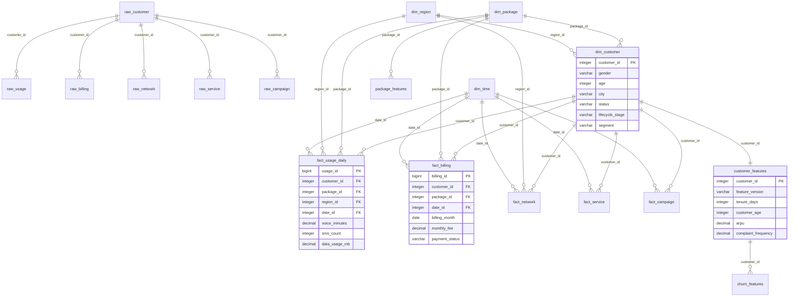

# InsightFlow — Database Design

Version 1.0 · Status: **Frozen** · Depends on: `02_ARCHITECTURE.md`

---

## Table of Contents

1. [Design Principles](#1-design-principles)
2. [Schema Overview](#2-schema-overview)
3. [Entity-Relationship Diagram](#3-entity-relationship-diagram)
4. [Raw Layer — Bronze](#4-raw-layer--bronze)
5. [Warehouse Layer — Silver](#5-warehouse-layer--silver)
6. [Feature Store — Gold](#6-feature-store--gold)
7. [Semantic Layer](#7-semantic-layer)
8. [Registry Tables](#8-registry-tables)
9. [Index Strategy](#9-index-strategy)
10. [Data Lifecycle](#10-data-lifecycle)
11. [Field Provenance Map](#11-field-provenance-map)
12. [Migration Strategy](#12-migration-strategy)

---

# 1. Design Principles

| # | Principle | Enforcement |
|---|-----------|-------------|
| P1 | **Bronze is append-only.** No UPDATE, no DELETE on raw tables. | DB-level: revoke UPDATE/DELETE on `raw` schema |
| P2 | **One metric, one definition, one source.** | Metric Registry is the authoritative source |
| P3 | **Feature Store is ML-only.** Analytics and dashboards read from Semantic or Warehouse, never Feature Store. | Enforced by schema permissions |
| P4 | **Star Schema for analytics.** Fact tables reference dimension tables. No snowflake for MVP. | Foreign keys enforce this |
| P5 | **Natural keys in Bronze, surrogate keys in Silver.** | `raw_*` uses source IDs; `warehouse.*` uses auto-generated PKs |
| P6 | **Every table has `created_at`; mutable tables have `updated_at`.** | Column convention |
| P7 | **No business logic in the database.** Views and materialized views are render-only; calculations happen in the Analytics service. | Code review |

---

# 2. Schema Overview

```
PostgreSQL Database: insightflow

┌─────────────────────────────────────────┐
│  Schema          │  Layer       │ Access│
├──────────────────┼──────────────┼───────┤
│  raw             │  Bronze      │ ETL only (read/write); all others denied │
│  warehouse       │  Silver      │ ETL (write), Analytics (read), AI Copilot (read) │
│  feature_store   │  Gold        │ ETL (write), ML Pipeline (read) │
│  semantic        │  Semantic    │ ETL (refresh), API/Dashboard/AI Copilot (read) │
│  ml              │  ML Metadata │ ML Pipeline (read/write), API (read) │
│  public          │  Shared      │ All services (lookup tables, enums) │
└─────────────────────────────────────────┘
```

### Schema Access Matrix

| Consumer          | `raw` | `warehouse` | `feature_store` | `semantic` | `ml` |
| ----------------- |:-----:|:-----------:|:---------------:|:----------:|:----:|
| ETL Pipeline      |  CRUD |    CRUD     |      CRUD       |   REFRESH  |  —   |
| Analytics Engine  |   —   |    READ     |       —         |    READ    |  —   |
| ML Pipeline       |   —   |     —       |      READ       |     —      | CRUD |
| AI Copilot        |   —   |    READ     |       —         |    READ    | READ |
| Report Generator  |   —   |     —       |       —         |    READ    | READ |
| API / Dashboard   |   —   |     —       |       —         |    READ    | READ |
| Admin (future)    |  READ |    READ     |      READ       |    READ    | READ |

---

# 3. Entity-Relationship Diagram



---

# 4. Raw Layer — Bronze

Schema: `raw`

**Rules**: Append-only. Exact copy of source data. No transformation. Retained indefinitely.

## 4.1 raw_customer

Source: CRM system export.

| # | Column | Type | Required | Description | Validation |
|---|--------|------|----------|-------------|------------|
| 1 | `raw_id` | `BIGSERIAL` | ✅ | Auto-generated surrogate key | — |
| 2 | `customer_id` | `VARCHAR(50)` | ✅ | Source system customer identifier | NOT NULL, UNIQUE per batch |
| 3 | `gender` | `VARCHAR(10)` | | Male / Female / Other | IN ('Male','Female','Other', NULL) |
| 4 | `age` | `INTEGER` | | Customer age at import time | >= 0, <= 120 |
| 5 | `city` | `VARCHAR(100)` | | City name | — |
| 6 | `province` | `VARCHAR(100)` | | Province/State | — |
| 7 | `join_date` | `DATE` | ✅ | Subscription start date | <= CURRENT_DATE |
| 8 | `contract_type` | `VARCHAR(30)` | ✅ | prepaid / postpaid / hybrid | IN ('prepaid','postpaid','hybrid') |
| 9 | `package_id` | `VARCHAR(50)` | ✅ | Source package identifier | NOT NULL |
| 10 | `package_name` | `VARCHAR(100)` | | Package display name | — |
| 11 | `status` | `VARCHAR(20)` | ✅ | active / suspended / churned | IN ('active','suspended','churned') |
| 12 | `import_batch_id` | `VARCHAR(100)` | ✅ | Which ETL batch imported this row | NOT NULL |
| 13 | `imported_at` | `TIMESTAMPTZ` | ✅ | When this row was inserted | DEFAULT now() |
| 14 | `source_filename` | `VARCHAR(255)` | | Original CSV/Parquet filename | — |

**Indexes**:
- `idx_raw_customer_id ON (customer_id)` — dedup check
- `idx_raw_customer_batch ON (import_batch_id)` — batch traceability

**Partitioning**: None for MVP. Re-evaluate at 10M+ rows.

---

## 4.2 raw_usage

Source: Network usage export (daily granularity).

| # | Column | Type | Required | Description | Validation |
|---|--------|------|----------|-------------|------------|
| 1 | `raw_id` | `BIGSERIAL` | ✅ | Surrogate key | — |
| 2 | `customer_id` | `VARCHAR(50)` | ✅ | FK → raw_customer | Must exist in raw_customer or quarantine |
| 3 | `usage_date` | `DATE` | ✅ | Date of usage record | <= CURRENT_DATE |
| 4 | `voice_minutes` | `DECIMAL(10,2)` | | Outbound call minutes | >= 0 |
| 5 | `sms_count` | `INTEGER` | | SMS sent | >= 0 |
| 6 | `data_usage_mb` | `DECIMAL(12,2)` | | Mobile data consumed (MB) | >= 0 |
| 7 | `roaming_usage_mb` | `DECIMAL(10,2)` | | Roaming data (MB) | >= 0 |
| 8 | `peak_usage_mb` | `DECIMAL(10,2)` | | Usage during peak hours (MB) | >= 0 |
| 9 | `international_minutes` | `DECIMAL(8,2)` | | International call minutes | >= 0 |
| 10 | `import_batch_id` | `VARCHAR(100)` | ✅ | ETL batch identifier | NOT NULL |
| 11 | `imported_at` | `TIMESTAMPTZ` | ✅ | Insertion timestamp | DEFAULT now() |
| 12 | `source_filename` | `VARCHAR(255)` | | — | — |

**Indexes**:
- `idx_raw_usage_customer ON (customer_id, usage_date)`
- `idx_raw_usage_batch ON (import_batch_id)`

---

## 4.3 raw_billing

Source: Billing system monthly export.

| # | Column | Type | Required | Description | Validation |
|---|--------|------|----------|-------------|------------|
| 1 | `raw_id` | `BIGSERIAL` | ✅ | Surrogate key | — |
| 2 | `customer_id` | `VARCHAR(50)` | ✅ | FK → raw_customer | — |
| 3 | `billing_month` | `DATE` | ✅ | First day of billing month | Day must be 01 |
| 4 | `monthly_fee` | `DECIMAL(10,2)` | ✅ | Base plan fee | >= 0 |
| 5 | `discount_amount` | `DECIMAL(10,2)` | | Applied discount | >= 0, <= monthly_fee |
| 6 | `payment_status` | `VARCHAR(20)` | ✅ | paid / overdue / pending | IN ('paid','overdue','pending') |
| 7 | `overdue_days` | `INTEGER` | | Days past due | >= 0 |
| 8 | `package_price` | `DECIMAL(10,2)` | ✅ | List price of package | >= 0 |
| 9 | `payment_method` | `VARCHAR(30)` | | credit_card / bank_transfer / wallet / cash | — |
| 10 | `import_batch_id` | `VARCHAR(100)` | ✅ | — | NOT NULL |
| 11 | `imported_at` | `TIMESTAMPTZ` | ✅ | — | DEFAULT now() |
| 12 | `source_filename` | `VARCHAR(255)` | | — | — |

**Indexes**:
- `idx_raw_billing_customer ON (customer_id, billing_month)`
- `idx_raw_billing_batch ON (import_batch_id)`

---

## 4.4 raw_network

Source: Network monitoring system.

| # | Column | Type | Required | Description | Validation |
|---|--------|------|----------|-------------|------------|
| 1 | `raw_id` | `BIGSERIAL` | ✅ | Surrogate key | — |
| 2 | `customer_id` | `VARCHAR(50)` | ✅ | — | — |
| 3 | `measurement_date` | `DATE` | ✅ | Date of measurement | — |
| 4 | `latency_ms` | `DECIMAL(8,2)` | | Round-trip latency | >= 0, <= 10000 |
| 5 | `signal_strength` | `DECIMAL(5,2)` | | dBm normalized to 0-100 scale | BETWEEN 0 AND 100 |
| 6 | `drop_rate` | `DECIMAL(5,4)` | | Call drop rate | BETWEEN 0 AND 1 |
| 7 | `packet_loss` | `DECIMAL(5,4)` | | Packet loss rate | BETWEEN 0 AND 1 |
| 8 | `coverage_score` | `DECIMAL(5,2)` | | Composite coverage quality | BETWEEN 0 AND 100 |
| 9 | `import_batch_id` | `VARCHAR(100)` | ✅ | — | NOT NULL |
| 10 | `imported_at` | `TIMESTAMPTZ` | ✅ | — | DEFAULT now() |
| 11 | `source_filename` | `VARCHAR(255)` | | — | — |

**Indexes**:
- `idx_raw_network_customer ON (customer_id, measurement_date)`
- `idx_raw_network_batch ON (import_batch_id)`

---

## 4.5 raw_service

Source: Customer service ticketing system.

| # | Column | Type | Required | Description | Validation |
|---|--------|------|----------|-------------|------------|
| 1 | `raw_id` | `BIGSERIAL` | ✅ | Surrogate key | — |
| 2 | `customer_id` | `VARCHAR(50)` | ✅ | — | — |
| 3 | `ticket_date` | `DATE` | ✅ | Date ticket was opened | — |
| 4 | `ticket_count` | `INTEGER` | ✅ | Number of tickets that day | >= 0 |
| 5 | `complaint_type` | `VARCHAR(50)` | | billing / network / service / other | — |
| 6 | `waiting_time_min` | `DECIMAL(8,2)` | | Minutes before first response | >= 0 |
| 7 | `resolution_time_min` | `DECIMAL(8,2)` | | Minutes to resolution | >= 0 |
| 8 | `csat_score` | `INTEGER` | | Customer satisfaction (post-resolution) | BETWEEN 1 AND 5 |
| 9 | `escalation_count` | `INTEGER` | | Number of escalations | >= 0 |
| 10 | `import_batch_id` | `VARCHAR(100)` | ✅ | — | NOT NULL |
| 11 | `imported_at` | `TIMESTAMPTZ` | ✅ | — | DEFAULT now() |
| 12 | `source_filename` | `VARCHAR(255)` | | — | — |

**Indexes**:
- `idx_raw_service_customer ON (customer_id, ticket_date)`
- `idx_raw_service_batch ON (import_batch_id)`

---

## 4.6 raw_campaign

Source: Marketing platform.

| # | Column | Type | Required | Description | Validation |
|---|--------|------|----------|-------------|------------|
| 1 | `raw_id` | `BIGSERIAL` | ✅ | Surrogate key | — |
| 2 | `customer_id` | `VARCHAR(50)` | ✅ | — | — |
| 3 | `campaign_id` | `VARCHAR(50)` | ✅ | Source campaign identifier | NOT NULL |
| 4 | `campaign_date` | `DATE` | ✅ | Date of campaign touch | — |
| 5 | `promotion_type` | `VARCHAR(50)` | | discount / bundle_upgrade / free_trial / loyalty_reward | — |
| 6 | `coupon_used` | `BOOLEAN` | | Did customer use the coupon? | — |
| 7 | `converted` | `BOOLEAN` | | Did the touch convert? | — |
| 8 | `channel` | `VARCHAR(30)` | | sms / email / app_push / call_center | — |
| 9 | `campaign_cost` | `DECIMAL(10,2)` | | Cost attributed to this touch | >= 0 |
| 10 | `import_batch_id` | `VARCHAR(100)` | ✅ | — | NOT NULL |
| 11 | `imported_at` | `TIMESTAMPTZ` | ✅ | — | DEFAULT now() |
| 12 | `source_filename` | `VARCHAR(255)` | | — | — |

**Indexes**:
- `idx_raw_campaign_customer ON (customer_id, campaign_date)`
- `idx_raw_campaign_batch ON (import_batch_id)`

---

# 5. Warehouse Layer — Silver

Schema: `warehouse`

**Rules**: Validated, deduplicated, normalized. Star Schema with surrogate integer keys. All fact tables reference four dimension tables.

## 5.1 Dimension Tables

### 5.1.1 dim_time

Central time dimension. **Pre-populated** (not derived from raw data).

| # | Column | Type | Description | Example |
|---|--------|------|-------------|---------|
| 1 | `date_id` | `INTEGER` PK | YYYYMMDD format | 20260815 |
| 2 | `full_date` | `DATE` NOT NULL UNIQUE | Actual date | 2026-08-15 |
| 3 | `year` | `SMALLINT` | Calendar year | 2026 |
| 4 | `quarter` | `SMALLINT` | 1-4 | 3 |
| 5 | `month` | `SMALLINT` | 1-12 | 8 |
| 6 | `week` | `SMALLINT` | ISO week 1-53 | 33 |
| 7 | `day` | `SMALLINT` | 1-31 | 15 |
| 8 | `day_of_week` | `SMALLINT` | 1=Mon, 7=Sun | 6 |
| 9 | `day_name` | `VARCHAR(10)` | Monday-Sunday | Saturday |
| 10 | `is_weekend` | `BOOLEAN` | True if Sat/Sun | true |
| 11 | `fiscal_year` | `SMALLINT` | Fiscal year | 2026 |
| 12 | `fiscal_quarter` | `SMALLINT` | Fiscal quarter 1-4 | 3 |

Seed data range: 2020-01-01 through 2030-12-31 (~4,018 rows).

---

### 5.1.2 dim_customer

SCD Type 1 (overwrite on change) for MVP. Populated from `raw_customer` via ETL.

| # | Column | Type | Required | Description | Source |
|---|--------|------|----------|-------------|--------|
| 1 | `customer_id` | `INTEGER` PK | ✅ | Surrogate warehouse key (auto-generated) | ETL sequence |
| 2 | `source_customer_id` | `VARCHAR(50)` | ✅ | Original CRM customer ID | `raw_customer.customer_id` |
| 3 | `gender` | `VARCHAR(10)` | | | `raw_customer.gender` |
| 4 | `age` | `INTEGER` | | | `raw_customer.age` |
| 5 | `city` | `VARCHAR(100)` | | | `raw_customer.city` |
| 6 | `province` | `VARCHAR(100)` | | | `raw_customer.province` |
| 7 | `region_id` | `INTEGER` | | FK → dim_region | Mapped from city/province |
| 8 | `join_date` | `DATE` | ✅ | | `raw_customer.join_date` |
| 9 | `contract_type` | `VARCHAR(30)` | ✅ | prepaid / postpaid / hybrid | `raw_customer.contract_type` |
| 10 | `package_id` | `INTEGER` | | FK → dim_package | Mapped from `raw_customer.package_id` |
| 11 | `status` | `VARCHAR(20)` | ✅ | active / suspended / churned | `raw_customer.status` |
| 12 | `lifecycle_stage` | `VARCHAR(30)` | ✅ | new / active / at_risk / churned | Derived by ETL |
| 13 | `segment` | `VARCHAR(50)` | | premium / heavy_user / price_sensitive / business / dormant | Populated by ML segmentation |
| 14 | `clv` | `DECIMAL(12,2)` | | Customer Lifetime Value | Calculated by Analytics |
| 15 | `created_at` | `TIMESTAMPTZ` | ✅ | First seen | ETL |
| 16 | `updated_at` | `TIMESTAMPTZ` | ✅ | Last modified | ETL |

**Customer Lifecycle State Machine**:

```
                     ┌─────────┐
                     │   new   │  (0–90 days since join_date)
                     └────┬────┘
                          │
                     ┌────▼────┐
          ┌──────────│ active  │──────────┐
          │          └────┬────┘          │
          │               │               │
          │   (churn_risk │               │ (churn event:
          │    score >    │               │  status='churned'
          │    threshold) │               │  OR no usage 90+ days)
          │               │               │
     ┌────▼────┐          │          ┌────▼────┐
     │ at_risk │          │          │ churned │
     └────┬────┘          │          └─────────┘
          │               │
          │ (risk drops)  │
          └──────►────────┘
```

Lifecycle transition rules:
- `new` → `active`: `tenure_days > 90` AND `status = 'active'`
- `active` → `at_risk`: `churn_risk_score >= 0.6` (from ML)
- `at_risk` → `active`: `churn_risk_score < 0.4` AND `status = 'active'`
- `active` → `churned`: `status = 'churned'` OR (`no usage records > 90 days` AND `status != 'suspended'`)
- `at_risk` → `churned`: same as above

**Indexes**:
- `idx_dim_customer_status ON (status)` — filtering active/churned
- `idx_dim_customer_segment ON (segment)` — segmentation queries
- `idx_dim_customer_lifecycle ON (lifecycle_stage)` — lifecycle filtering
- `idx_dim_customer_source ON (source_customer_id)` — lookup from raw

---

### 5.1.3 dim_package

Populated from `raw_customer` distinct packages + manual enrichment.

| # | Column | Type | Required | Description |
|---|--------|------|----------|-------------|
| 1 | `package_id` | `INTEGER` PK | ✅ | Surrogate key |
| 2 | `source_package_id` | `VARCHAR(50)` | ✅ | Original package code |
| 3 | `package_name` | `VARCHAR(100)` | ✅ | Display name |
| 4 | `package_type` | `VARCHAR(30)` | ✅ | voice_only / data_only / bundle / premium / family / business |
| 5 | `monthly_price` | `DECIMAL(10,2)` | ✅ | List price |
| 6 | `data_quota_gb` | `DECIMAL(8,2)` | | Monthly data allowance |
| 7 | `voice_quota_min` | `INTEGER` | | Monthly voice allowance |
| 8 | `sms_quota` | `INTEGER` | | Monthly SMS allowance |
| 9 | `is_active` | `BOOLEAN` | ✅ | Currently offered? Default true |
| 10 | `launched_date` | `DATE` | | When package was introduced |
| 11 | `retired_date` | `DATE` | | When package was discontinued |

---

### 5.1.4 dim_region

Populated from `raw_customer` distinct city/province combinations.

| # | Column | Type | Required | Description |
|---|--------|------|----------|-------------|
| 1 | `region_id` | `INTEGER` PK | ✅ | Surrogate key |
| 2 | `region_name` | `VARCHAR(100)` | ✅ | East / South / North / West / Central |
| 3 | `province` | `VARCHAR(100)` | ✅ | Province name |
| 4 | `city` | `VARCHAR(100)` | | City name (NULL = province-level aggregation) |
| 5 | `city_tier` | `VARCHAR(10)` | | T1 / T2 / T3 (telco market classification) |

---

## 5.2 Fact Tables

### 5.2.1 fact_usage_daily

Granularity: one row per customer per day.

| # | Column | Type | Required | FK | Description |
|---|--------|------|----------|----|-------------|
| 1 | `usage_id` | `BIGSERIAL` PK | ✅ | — | Surrogate key |
| 2 | `customer_id` | `INTEGER` | ✅ | dim_customer | — |
| 3 | `package_id` | `INTEGER` | ✅ | dim_package | Package at time of usage |
| 4 | `region_id` | `INTEGER` | ✅ | dim_region | Customer's region |
| 5 | `date_id` | `INTEGER` | ✅ | dim_time | — |
| 6 | `voice_minutes` | `DECIMAL(10,2)` | | — | Outbound call minutes |
| 7 | `sms_count` | `INTEGER` | | — | SMS sent |
| 8 | `data_usage_mb` | `DECIMAL(12,2)` | | — | Total data (MB) |
| 9 | `roaming_usage_mb` | `DECIMAL(10,2)` | | — | Roaming data (MB) |
| 10 | `peak_usage_mb` | `DECIMAL(10,2)` | | — | Peak-hour data (MB) |
| 11 | `international_minutes` | `DECIMAL(8,2)` | | — | International call minutes |
| 12 | `created_at` | `TIMESTAMPTZ` | ✅ | — | DEFAULT now() |

**Derived column conventions** (not stored — computed in Analytics service):
- `off_peak_usage_mb` = `data_usage_mb - peak_usage_mb`
- `weekend_usage_ratio` = weekend data / total data (computed per period)
- `night_usage_ratio` = 22:00–06:00 data / total data

**Indexes**:
- `idx_fud_customer_date ON (customer_id, date_id)` — **primary access pattern**
- `idx_fud_date ON (date_id)` — daily aggregation
- `idx_fud_package_date ON (package_id, date_id)` — package-level analytics
- `idx_fud_region_date ON (region_id, date_id)` — regional analytics

---

### 5.2.2 fact_billing

Granularity: one row per customer per month.

| # | Column | Type | Required | FK | Description |
|---|--------|------|----------|----|-------------|
| 1 | `billing_id` | `BIGSERIAL` PK | ✅ | — | Surrogate key |
| 2 | `customer_id` | `INTEGER` | ✅ | dim_customer | — |
| 3 | `package_id` | `INTEGER` | ✅ | dim_package | Package billed |
| 4 | `date_id` | `INTEGER` | ✅ | dim_time | First day of billing month |
| 5 | `billing_month` | `DATE` | ✅ | — | Always YYYY-MM-01 |
| 6 | `monthly_fee` | `DECIMAL(10,2)` | ✅ | — | Base plan fee |
| 7 | `discount_amount` | `DECIMAL(10,2)` | | — | Applied discount |
| 8 | `net_revenue` | `DECIMAL(10,2)` | ✅ | — | `monthly_fee - discount_amount` |
| 9 | `payment_status` | `VARCHAR(20)` | ✅ | — | paid / overdue / pending |
| 10 | `overdue_days` | `INTEGER` | | — | Days past due |
| 11 | `package_price` | `DECIMAL(10,2)` | ✅ | — | List price |
| 12 | `created_at` | `TIMESTAMPTZ` | ✅ | — | DEFAULT now() |

**Derived columns** (computed in Analytics, not stored):
- `discount_ratio` = `discount_amount / package_price`
- `payment_delay_avg` = rolling average of `overdue_days`

**Indexes**:
- `idx_fb_customer_month ON (customer_id, billing_month)` — **primary access pattern**
- `idx_fb_month ON (billing_month)` — monthly revenue rollup
- `idx_fb_status ON (payment_status, billing_month)` — overdue analysis

---

### 5.2.3 fact_network

Granularity: one row per customer per day.

| # | Column | Type | Required | FK | Description |
|---|--------|------|----------|----|-------------|
| 1 | `network_id` | `BIGSERIAL` PK | ✅ | — | Surrogate key |
| 2 | `customer_id` | `INTEGER` | ✅ | dim_customer | — |
| 3 | `region_id` | `INTEGER` | ✅ | dim_region | — |
| 4 | `date_id` | `INTEGER` | ✅ | dim_time | — |
| 5 | `latency_ms` | `DECIMAL(8,2)` | | — | Round-trip latency |
| 6 | `signal_strength` | `DECIMAL(5,2)` | | — | 0-100 normalized |
| 7 | `drop_rate` | `DECIMAL(5,4)` | | — | 0.0000–1.0000 |
| 8 | `packet_loss` | `DECIMAL(5,4)` | | — | 0.0000–1.0000 |
| 9 | `coverage_score` | `DECIMAL(5,2)` | | — | 0-100 composite |
| 10 | `created_at` | `TIMESTAMPTZ` | ✅ | — | DEFAULT now() |

**Indexes**:
- `idx_fn_customer_date ON (customer_id, date_id)`
- `idx_fn_region_date ON (region_id, date_id)`

---

### 5.2.4 fact_service

Granularity: one row per customer per day.

| # | Column | Type | Required | FK | Description |
|---|--------|------|----------|----|-------------|
| 1 | `service_id` | `BIGSERIAL` PK | ✅ | — | Surrogate key |
| 2 | `customer_id` | `INTEGER` | ✅ | dim_customer | — |
| 3 | `date_id` | `INTEGER` | ✅ | dim_time | — |
| 4 | `ticket_count` | `INTEGER` | ✅ | — | Number of tickets opened |
| 5 | `complaint_type` | `VARCHAR(50)` | | — | billing / network / service / other |
| 6 | `waiting_time_min` | `DECIMAL(8,2)` | | — | Minutes before first response |
| 7 | `resolution_time_min` | `DECIMAL(8,2)` | | — | Minutes to resolution |
| 8 | `csat_score` | `INTEGER` | | — | 1–5, only when surveyed |
| 9 | `escalation_count` | `INTEGER` | | — | Escalations that day |
| 10 | `created_at` | `TIMESTAMPTZ` | ✅ | — | DEFAULT now() |

**Indexes**:
- `idx_fs_customer_date ON (customer_id, date_id)`
- `idx_fs_type ON (complaint_type, date_id)` — complaint type trend analysis

---

### 5.2.5 fact_campaign

Granularity: one row per customer per campaign touch.

| # | Column | Type | Required | FK | Description |
|---|--------|------|----------|----|-------------|
| 1 | `campaign_response_id` | `BIGSERIAL` PK | ✅ | — | Surrogate key |
| 2 | `customer_id` | `INTEGER` | ✅ | dim_customer | — |
| 3 | `campaign_id` | `VARCHAR(50)` | ✅ | — | Source campaign code |
| 4 | `date_id` | `INTEGER` | ✅ | dim_time | Date of touch |
| 5 | `promotion_type` | `VARCHAR(50)` | | — | discount / bundle_upgrade / free_trial / loyalty_reward |
| 6 | `coupon_used` | `BOOLEAN` | | — | — |
| 7 | `converted` | `BOOLEAN` | | — | — |
| 8 | `channel` | `VARCHAR(30)` | | — | sms / email / app_push / call_center |
| 9 | `campaign_cost` | `DECIMAL(10,2)` | | — | Cost for this touch |
| 10 | `created_at` | `TIMESTAMPTZ` | ✅ | — | DEFAULT now() |

**Indexes**:
- `idx_fc_customer_date ON (customer_id, date_id)`
- `idx_fc_campaign ON (campaign_id, date_id)` — campaign performance
- `idx_fc_converted ON (converted, date_id)` — conversion rate queries

---

# 6. Feature Store — Gold

Schema: `feature_store`

**Rules**: ML-only access. Versioned. One wide table per entity. Regenerated nightly by ETL.

## 6.1 customer_features

One row per customer. Regenerated from `warehouse.*` by the feature generation pipeline.

| # | Column | Type | Description | Source Table(s) | Category |
|---|--------|------|-------------|-----------------|----------|
| — | `customer_id` | `INTEGER` PK | FK → dim_customer | dim_customer | — |
| — | `feature_version` | `VARCHAR(20)` | Version tag, e.g. 'v1.0.0' | ETL metadata | — |
| — | `generated_at` | `TIMESTAMPTZ` | When features were computed | ETL metadata | — |
| 1 | `tenure_days` | `INTEGER` | Days since join_date | dim_customer | Customer |
| 2 | `customer_age` | `INTEGER` | Age as of feature generation | dim_customer | Customer |
| 3 | `contract_duration_months` | `INTEGER` | Months since contract start | dim_customer | Customer |
| 4 | `is_postpaid` | `BOOLEAN` | contract_type = 'postpaid' | dim_customer | Customer |
| 5 | `is_prepaid` | `BOOLEAN` | contract_type = 'prepaid' | dim_customer | Customer |
| 6 | `avg_daily_data_mb` | `DECIMAL(10,2)` | Mean daily data (last 90 days) | fact_usage_daily | Usage |
| 7 | `avg_daily_voice_min` | `DECIMAL(8,2)` | Mean daily voice (last 90 days) | fact_usage_daily | Usage |
| 8 | `data_usage_trend` | `DECIMAL(6,4)` | Slope of data usage over 90 days | fact_usage_daily | Usage |
| 9 | `voice_usage_trend` | `DECIMAL(6,4)` | Slope of voice usage over 90 days | fact_usage_daily | Usage |
| 10 | `weekend_usage_ratio` | `DECIMAL(5,4)` | Weekend data / total data (90d) | fact_usage_daily + dim_time | Usage |
| 11 | `night_usage_ratio` | `DECIMAL(5,4)` | Off-peak data / total data (90d) | fact_usage_daily | Usage |
| 12 | `peak_usage_ratio` | `DECIMAL(5,4)` | Peak data / total data (90d) | fact_usage_daily | Usage |
| 13 | `roaming_ratio` | `DECIMAL(5,4)` | Roaming data / total data (90d) | fact_usage_daily | Usage |
| 14 | `international_ratio` | `DECIMAL(5,4)` | Intl minutes / total minutes (90d) | fact_usage_daily | Usage |
| 15 | `arpu` | `DECIMAL(10,2)` | Average monthly revenue (6 months) | fact_billing | Billing |
| 16 | `revenue_trend` | `DECIMAL(6,4)` | Slope of net_revenue (6 months) | fact_billing | Billing |
| 17 | `discount_ratio` | `DECIMAL(5,4)` | avg(discount_amount / package_price) | fact_billing | Billing |
| 18 | `payment_delay_avg` | `DECIMAL(6,2)` | Mean overdue_days (6 months) | fact_billing | Billing |
| 19 | `overdue_count` | `INTEGER` | Months with overdue payments (6m) | fact_billing | Billing |
| 20 | `payment_method_changed` | `BOOLEAN` | Payment method changed in period | fact_billing (deduced) | Billing |
| 21 | `drop_rate_avg` | `DECIMAL(5,4)` | Mean drop_rate (90 days) | fact_network | Network |
| 22 | `drop_rate_trend` | `DECIMAL(6,4)` | Slope of drop_rate (90 days) | fact_network | Network |
| 23 | `latency_avg_ms` | `DECIMAL(8,2)` | Mean latency (90 days) | fact_network | Network |
| 24 | `latency_trend` | `DECIMAL(6,4)` | Slope of latency (90 days) | fact_network | Network |
| 25 | `coverage_score_avg` | `DECIMAL(5,2)` | Mean coverage score (90 days) | fact_network | Network |
| 26 | `signal_stability` | `DECIMAL(5,4)` | 1 - std(signal_strength)/mean | fact_network | Network |
| 27 | `network_quality_index` | `DECIMAL(5,2)` | Composite: coverage - drop_penalty - latency_penalty | fact_network | Network |
| 28 | `complaint_frequency` | `DECIMAL(6,4)` | Tickets per day (90 days) | fact_service | Service |
| 29 | `complaint_trend` | `DECIMAL(6,4)` | Slope of ticket_count (90 days) | fact_service | Service |
| 30 | `network_complaint_ratio` | `DECIMAL(5,4)` | Network complaints / total complaints | fact_service | Service |
| 31 | `billing_complaint_ratio` | `DECIMAL(5,4)` | Billing complaints / total complaints | fact_service | Service |
| 32 | `avg_resolution_time_min` | `DECIMAL(8,2)` | Mean resolution_time (90 days) | fact_service | Service |
| 33 | `avg_waiting_time_min` | `DECIMAL(8,2)` | Mean waiting_time (90 days) | fact_service | Service |
| 34 | `csat_avg` | `DECIMAL(4,2)` | Mean CSAT (90 days, non-null) | fact_service | Service |
| 35 | `csat_trend` | `DECIMAL(6,4)` | Slope of CSAT (90 days) | fact_service | Service |
| 36 | `escalation_frequency` | `DECIMAL(6,4)` | Escalations per day (90 days) | fact_service | Service |
| 37 | `package_upgrade_count` | `INTEGER` | Number of package upgrades (lifetime) | fact_billing (package_id changes) | Behavioral |
| 38 | `package_downgrade_count` | `INTEGER` | Number of package downgrades (lifetime) | fact_billing | Behavioral |
| 39 | `promotion_response_rate` | `DECIMAL(5,4)` | converted / total_campaign_touches | fact_campaign | Behavioral |
| 40 | `recharge_frequency` | `DECIMAL(6,2)` | Days between recharges (prepaid) | fact_billing | Behavioral |
| 41 | `data_quota_utilization` | `DECIMAL(5,4)` | avg_daily_data_mb * 30 / data_quota_gb / 1024 | fact_usage_daily + dim_package | Behavioral |
| 42 | `days_since_last_complaint` | `INTEGER` | Days since most recent ticket | fact_service | Behavioral |
| 43 | `days_since_last_campaign` | `INTEGER` | Days since most recent campaign touch | fact_campaign | Behavioral |
| 44 | `is_heavy_user` | `BOOLEAN` | Top 20% by data usage | Derived | Segment |
| 45 | `is_premium` | `BOOLEAN` | package_type = 'premium' OR arpu > P80 | dim_package + fact_billing | Segment |

**Version tracking**: Every regeneration creates a new `feature_version`. Old versions are retained for 90 days for model reproducibility, then pruned.

**Index**: `idx_cf_version ON (feature_version)` — allows querying "give me features as of version v1.2.0".

---

## 6.2 churn_features

Derived from `customer_features` with churn-specific transformations. One row per customer.

| # | Column | Type | Description |
|---|--------|------|-------------|
| — | `customer_id` | `INTEGER` PK | FK → dim_customer |
| — | `feature_version` | `VARCHAR(20)` | — |
| — | `generated_at` | `TIMESTAMPTZ` | — |
| 1 | `is_churn` | `BOOLEAN` | **Label**: True if customer churned in the observation window |
| 2 | `churn_window_end` | `DATE` | End date of churn observation window |
| 3 | `usage_decline_velocity` | `DECIMAL(6,4)` | How fast data usage is declining |
| 4 | `revenue_decline_velocity` | `DECIMAL(6,4)` | How fast revenue is declining |
| 5 | `complaint_spike_indicator` | `BOOLEAN` | complaint_frequency > 2× rolling average |
| 6 | `network_degradation_score` | `DECIMAL(5,4)` | Composite of network deterioration signals |
| 7 | `payment_risk_score` | `DECIMAL(5,4)` | Composite of payment delay signals |
| 8 | `inactivity_risk` | `DECIMAL(5,4)` | 1.0 if no usage records > 30 days, scaling down |
| 9 | `downgrade_recent` | `BOOLEAN` | Package downgrade in last 60 days |
| 10 | `retention_campaign_eligible` | `BOOLEAN` | Has not received retention offer in 90 days |

---

## 6.3 package_features

Package-level aggregations for recommendation ranking. One row per package.

| # | Column | Type | Description |
|---|--------|------|-------------|
| — | `package_id` | `INTEGER` PK | FK → dim_package |
| — | `feature_version` | `VARCHAR(20)` | — |
| — | `generated_at` | `TIMESTAMPTZ` | — |
| 1 | `subscriber_count` | `INTEGER` | Active customers on this package |
| 2 | `avg_tenure_days` | `DECIMAL(8,2)` | Mean tenure of subscribers |
| 3 | `churn_rate` | `DECIMAL(5,4)` | Historical churn rate for this package |
| 4 | `avg_arpu` | `DECIMAL(10,2)` | Mean ARPU of subscribers |
| 5 | `upgrade_from_rate` | `DECIMAL(5,4)` | % customers who upgraded TO this package |
| 6 | `downgrade_to_rate` | `DECIMAL(5,4)` | % customers who downgraded FROM this package |
| 7 | `avg_csat` | `DECIMAL(4,2)` | Mean CSAT of subscribers |
| 8 | `price_to_quota_ratio` | `DECIMAL(8,4)` | monthly_price / data_quota_gb (lower = better value) |

---

# 7. Semantic Layer

Schema: `semantic`

**Purpose**: Pre-computed business metrics consumed by dashboards, APIs, and AI Copilot. Implemented as PostgreSQL **materialized views**.

## 7.1 kpi_arpu

```sql
CREATE MATERIALIZED VIEW semantic.kpi_arpu AS
SELECT
    dt.year,
    dt.month,
    dr.region_name,
    dp.package_name,
    SUM(fb.net_revenue) / COUNT(DISTINCT fb.customer_id) AS arpu,
    COUNT(DISTINCT fb.customer_id) AS customer_count,
    SUM(fb.net_revenue) AS total_revenue
FROM warehouse.fact_billing fb
JOIN warehouse.dim_time dt ON fb.date_id = dt.date_id
JOIN warehouse.dim_customer dc ON fb.customer_id = dc.customer_id
JOIN warehouse.dim_region dr ON dc.region_id = dr.region_id
JOIN warehouse.dim_package dp ON fb.package_id = dp.package_id
WHERE dc.status = 'active'
GROUP BY dt.year, dt.month, dr.region_name, dp.package_name;

CREATE UNIQUE INDEX idx_kpi_arpu ON semantic.kpi_arpu(year, month, region_name, package_name);
```

## 7.2 kpi_churn_rate

```sql
CREATE MATERIALIZED VIEW semantic.kpi_churn_rate AS
SELECT
    dt.year,
    dt.month,
    dr.region_name,
    COUNT(DISTINCT CASE WHEN dc.status = 'churned' THEN dc.customer_id END)::DECIMAL
        / NULLIF(COUNT(DISTINCT dc.customer_id), 0) AS churn_rate,
    COUNT(DISTINCT CASE WHEN dc.status = 'churned' THEN dc.customer_id END) AS churned_count,
    COUNT(DISTINCT dc.customer_id) AS total_customers
FROM warehouse.dim_customer dc
JOIN warehouse.dim_region dr ON dc.region_id = dr.region_id
JOIN warehouse.dim_time dt ON dc.join_date <= dt.full_date
WHERE dt.full_date = DATE_TRUNC('month', dt.full_date)  -- first of month snapshot
GROUP BY dt.year, dt.month, dr.region_name;

CREATE UNIQUE INDEX idx_kpi_churn ON semantic.kpi_churn_rate(year, month, region_name);
```

## 7.3 kpi_revenue

```sql
CREATE MATERIALIZED VIEW semantic.kpi_revenue AS
SELECT
    dt.year,
    dt.month,
    SUM(fb.net_revenue) AS mrr,
    SUM(fb.net_revenue) - LAG(SUM(fb.net_revenue)) OVER (ORDER BY dt.year, dt.month)
        AS mrr_change,
    SUM(fb.discount_amount) AS total_discounts
FROM warehouse.fact_billing fb
JOIN warehouse.dim_time dt ON fb.date_id = dt.date_id
GROUP BY dt.year, dt.month;

CREATE UNIQUE INDEX idx_kpi_revenue ON semantic.kpi_revenue(year, month);
```

## 7.4 Refresh Schedule

All materialized views are refreshed nightly via Celery:

```python
# Conceptual — ETL task
REFRESH_SCHEDULE = {
    "kpi_arpu":       "0 2 * * *",   # 2:00 AM daily
    "kpi_churn_rate": "0 2 * * *",
    "kpi_revenue":    "0 2 * * *",
}
```

Refresh strategy: `REFRESH MATERIALIZED VIEW CONCURRENTLY` (requires unique index on each view).

---

# 8. Registry Tables

Schema: `ml`, `semantic`

## 8.1 metric_registry (semantic)

Centralized KPI definitions. Every metric used anywhere in the system must be registered here first.

| # | Column | Type | Description |
|---|--------|------|-------------|
| 1 | `metric_id` | `SERIAL` PK | Auto-increment |
| 2 | `metric_name` | `VARCHAR(100)` UNIQUE | e.g. 'arpu', 'churn_rate', 'clv' |
| 3 | `category` | `VARCHAR(50)` | revenue / customer / usage / network / service / marketing |
| 4 | `business_definition` | `TEXT` | Human-readable definition |
| 5 | `formula` | `TEXT` | Formula in pseudo-SQL or mathematical notation |
| 6 | `unit` | `VARCHAR(30)` | '%' / 'USD' / 'count' / 'MB' / 'ms' |
| 7 | `data_source` | `VARCHAR(200)` | Which table(s) this metric derives from |
| 8 | `materialized_view` | `VARCHAR(100)` | Corresponding semantic view, if any |
| 9 | `refresh_cron` | `VARCHAR(50)` | Refresh frequency |
| 10 | `owner` | `VARCHAR(100)` | Responsible team/person |
| 11 | `version` | `VARCHAR(20)` | Semantic version of this definition |
| 12 | `is_deprecated` | `BOOLEAN` | Default false |
| 13 | `created_at` | `TIMESTAMPTZ` | — |
| 14 | `updated_at` | `TIMESTAMPTZ` | — |

**Seed data**: 50+ rows covering all KPI categories from PRD Part IV.

---

## 8.2 model_registry (ml)

| # | Column | Type | Description |
|---|--------|------|-------------|
| 1 | `model_id` | `SERIAL` PK | — |
| 2 | `model_name` | `VARCHAR(100)` | e.g. 'churn_xgboost', 'segmentation_kmeans' |
| 3 | `model_version` | `VARCHAR(20)` | Semantic version |
| 4 | `model_type` | `VARCHAR(30)` | churn_prediction / segmentation / revenue_forecast / recommendation |
| 5 | `algorithm` | `VARCHAR(50)` | xgboost / lightgbm / random_forest / logistic_regression / catboost / kmeans |
| 6 | `artifact_path` | `VARCHAR(500)` | MinIO object key for serialized model |
| 7 | `training_dataset_id` | `VARCHAR(100)` | Dataset version identifier |
| 8 | `feature_version` | `VARCHAR(20)` | Which feature version was used |
| 9 | `evaluation_report` | `JSONB` | precision, recall, f1, roc_auc, pr_auc, log_loss, confusion_matrix, calibration |
| 10 | `hyperparameters` | `JSONB` | Full hyperparameter config |
| 11 | `random_seed` | `INTEGER` | For reproducibility |
| 12 | `training_time_sec` | `INTEGER` | Wall-clock training duration |
| 13 | `framework_version` | `VARCHAR(30)` | xgboost==2.1.0 etc. |
| 14 | `status` | `VARCHAR(20)` | development / staging / production / archived |
| 15 | `promoted_at` | `TIMESTAMPTZ` | When promoted to production |
| 16 | `promoted_by` | `VARCHAR(100)` | Who promoted |
| 17 | `created_at` | `TIMESTAMPTZ` | — |

**UNIQUE constraint**: `(model_name, model_version)`

---

## 8.3 feature_registry (feature_store)

| # | Column | Type | Description |
|---|--------|------|-------------|
| 1 | `feature_id` | `SERIAL` PK | — |
| 2 | `feature_name` | `VARCHAR(100)` UNIQUE | e.g. 'arpu', 'complaint_frequency', 'drop_rate_avg' |
| 3 | `feature_table` | `VARCHAR(50)` | customer_features / churn_features / package_features |
| 4 | `description` | `TEXT` | Human-readable |
| 5 | `formula` | `TEXT` | How it's computed |
| 6 | `data_source` | `VARCHAR(200)` | Source warehouse tables |
| 7 | `data_type` | `VARCHAR(20)` | DECIMAL / INTEGER / BOOLEAN |
| 8 | `refresh_cron` | `VARCHAR(50)` | Regeneration schedule |
| 9 | `version` | `VARCHAR(20)` | Current active version |
| 10 | `owner` | `VARCHAR(100)` | — |
| 11 | `is_deprecated` | `BOOLEAN` | Default false |
| 12 | `created_at` | `TIMESTAMPTZ` | — |
| 13 | `updated_at` | `TIMESTAMPTZ` | — |

**Seed data**: 45 rows (matching all customer_features columns in §6.1).

---

## 8.4 prediction_registry (ml)

Stores individual churn predictions for auditability.

| # | Column | Type | Description |
|---|--------|------|-------------|
| 1 | `prediction_id` | `BIGSERIAL` PK | — |
| 2 | `customer_id` | `INTEGER` | FK → dim_customer |
| 3 | `model_id` | `INTEGER` | FK → model_registry |
| 4 | `feature_version` | `VARCHAR(20)` | Features used for this prediction |
| 5 | `risk_score` | `DECIMAL(5,4)` | 0–1 probability |
| 6 | `risk_level` | `VARCHAR(10)` | LOW / MEDIUM / HIGH |
| 7 | `top_positive_factors` | `JSONB` | `[{"feature":"complaint_frequency","contribution":0.32}, ...]` |
| 8 | `top_negative_factors` | `JSONB` | Factors decreasing risk |
| 9 | `confidence` | `DECIMAL(5,4)` | Model confidence for this prediction |
| 10 | `shap_values` | `JSONB` | Full SHAP value dict (nullable — stored on demand) |
| 11 | `prediction_type` | `VARCHAR(10)` | batch / online |
| 12 | `predicted_at` | `TIMESTAMPTZ` | When prediction was made |
| 13 | `observation_window` | `DATERANGE` | Period this prediction covers |

**Indexes**:
- `idx_pred_customer ON (customer_id, predicted_at DESC)` — customer prediction history
- `idx_pred_model ON (model_id, predicted_at)` — model performance tracking
- `idx_pred_risk ON (risk_level, predicted_at)` — high-risk customer queries

---

# 9. Index Strategy

### Performance-Critical Indexes

| Table | Index Columns | Justification |
|-------|--------------|---------------|
| `fact_usage_daily` | `(customer_id, date_id)` | 90% of queries filter by customer then date range |
| `fact_usage_daily` | `(date_id)` | Daily aggregations across all customers |
| `fact_billing` | `(customer_id, billing_month)` | Customer billing history |
| `fact_billing` | `(billing_month)` | Monthly MRR rollup |
| `fact_network` | `(customer_id, date_id)` | Customer network quality over time |
| `fact_service` | `(customer_id, date_id)` | Customer complaint history |
| `fact_campaign` | `(converted, date_id)` | Campaign conversion analysis |
| `dim_customer` | `(status)` | Active/churned filtering (very frequent) |
| `dim_customer` | `(segment)` | Segment-based analysis |
| `dim_customer` | `(lifecycle_stage)` | Lifecycle filtering |
| `customer_features` | `(feature_version)` | Feature version queries |
| `prediction_registry` | `(customer_id, predicted_at DESC)` | Customer prediction timeline |
| `prediction_registry` | `(risk_level, predicted_at)` | High-risk filtering |

### Index Naming Convention

```
idx_{table_abbrev}_{purpose}

Examples:
  idx_fud_customer_date   — fact_usage_daily, customer+date lookup
  idx_fb_month            — fact_billing, monthly aggregation
  idx_dc_status           — dim_customer, status filter
```

---

# 10. Data Lifecycle

## 10.1 Data Flow

```
External Sources (CSV/Parquet)
        │
        ▼
   raw.* (Bronze)          ← Append-only, indefinite retention
        │
        ▼ ETL Job #1: Validate, Deduplicate, Transform
        │
   warehouse.* (Silver)    ← Full refresh on dimension changes,
        │                     incremental append on fact tables
        ▼ ETL Job #2: Feature Generation (nightly)
        │
   feature_store.* (Gold)  ← Regenerated nightly, 90-day version retention
        │
        ▼ ETL Job #3: Materialized View Refresh (nightly)
        │
   semantic.*              ← REFRESH MATERIALIZED VIEW CONCURRENTLY
```

## 10.2 Retention Policies

| Layer | Retention | Cleanup Strategy |
|-------|-----------|-----------------|
| Bronze (`raw.*`) | Indefinite | Manual archival after 3 years (future) |
| Silver (`warehouse.*`) | Indefinite | Partition fact tables by year after MVP |
| Gold (`feature_store.*`) | 90 days per version | `DELETE WHERE generated_at < NOW() - INTERVAL '90 days' AND feature_version != (SELECT MAX(feature_version) ...)` |
| Semantic | Always latest | Refreshed nightly — no history |
| ML (`ml.*`) | Indefinite | Model artifacts in MinIO; predictions retained for audit |

## 10.3 Backup Strategy

| Component | Method | RPO |
|-----------|--------|-----|
| PostgreSQL | `pg_dump` nightly + WAL archiving | < 24 hours |
| MinIO | Bucket replication (future) | N/A for MVP |
| Redis | Not backed up (cache + ephemeral queue) | N/A |

---

# 11. Field Provenance Map

This table answers: **"Where does this field come from — source system or derived?"**

| Field | Origin | Transform |
|-------|--------|-----------|
| `dim_customer.customer_id` | ETL-generated | Auto-increment sequence |
| `dim_customer.source_customer_id` | CRM | Direct copy from `raw_customer.customer_id` |
| `dim_customer.status` | CRM | Direct copy; validated against enum |
| `dim_customer.lifecycle_stage` | **Derived** | Computed from status + tenure + churn_risk |
| `dim_customer.segment` | **ML** | KMeans/GMM output |
| `dim_customer.clv` | **Analytics** | ARPU × Gross Margin × Expected Lifetime |
| `dim_package.*` | Product Catalog | Enriched from `raw_customer` + manual entry |
| `dim_region.*` | **Derived** | Distinct city/province from `raw_customer`; city_tier is manual |
| `dim_time.*` | **Generated** | Pre-seeded date dimension script |
| `fact_usage_daily.*` | Network System | Direct copy from `raw_usage`, key resolution |
| `fact_billing.net_revenue` | **Derived** | `monthly_fee - discount_amount` |
| `fact_billing.*` (others) | Billing System | Direct copy from `raw_billing` |
| `fact_network.*` | Network Monitoring | Direct copy from `raw_network` |
| `fact_service.*` | CS Ticketing | Direct copy from `raw_service` |
| `fact_campaign.*` | Marketing Platform | Direct copy from `raw_campaign` |
| `customer_features.*` (all 45) | **Derived** | Aggregated/computed from warehouse fact+dims |
| `churn_features.is_churn` | **Derived (Label)** | True if customer churned in observation window |
| `semantic.kpi_*` | **Derived** | Aggregated from warehouse |

**Key**: Fields marked **Derived** must have their formula registered in the Metric Registry or Feature Registry. Fields marked **ML** are populated by ML pipeline output. All others are traceable to a single source system.

---

# 12. Migration Strategy

## 12.1 Tooling

- **Alembic** for all schema migrations
- Migration files live in `backend/alembic/versions/`
- Naming: `YYYYMMDD_HHMM_short_description.py`

## 12.2 Migration Principles

1. **Always expandable, never destructive**: Add columns, don't drop them. Add tables, don't rename them. Use `ALTER TABLE ... ADD COLUMN IF NOT EXISTS`.
2. **Idempotent seed data**: Seed scripts (dim_time, metric_registry, feature_registry) use `ON CONFLICT DO NOTHING` or `INSERT ... WHERE NOT EXISTS`.
3. **Bronze schema is append-only at the DB permission level**: `REVOKE UPDATE, DELETE ON ALL TABLES IN SCHEMA raw FROM etl_user;`
4. **Every migration is reversible**: `downgrade()` must be defined.
5. **No data migration in schema migrations**: Data fixes are separate scripts, tracked in a `data_migrations/` directory.

## 12.3 Initial Migration Sequence

```
001_create_schemas.sql        — CREATE SCHEMA raw, warehouse, feature_store, semantic, ml
002_seed_dim_time.sql         — INSERT dim_time (2020–2030)
003_create_dim_tables.sql     — dim_customer, dim_package, dim_region
004_create_fact_tables.sql    — fact_usage_daily, fact_billing, fact_network, fact_service, fact_campaign
005_create_feature_tables.sql — customer_features, churn_features, package_features
006_create_semantic_views.sql — kpi_arpu, kpi_churn_rate, kpi_revenue
007_create_registry_tables.sql— metric_registry, model_registry, feature_registry, prediction_registry
008_seed_registry_data.sql    — 50 metric definitions, 45 feature definitions
009_create_indexes.sql        — All performance indexes
010_set_permissions.sql        — Schema-level access control
```

---

# Appendix A: Naming Conventions

| Element | Convention | Example |
|---------|-----------|---------|
| Tables | `snake_case`, plural for facts | `fact_usage_daily`, `dim_customer` |
| Columns | `snake_case`, descriptive | `avg_daily_data_mb`, `payment_delay_avg` |
| Primary Keys | `{entity}_id` | `customer_id`, `billing_id` |
| Foreign Keys | Same as referenced PK | `customer_id` → `dim_customer.customer_id` |
| Indexes | `idx_{table_abbrev}_{purpose}` | `idx_fud_customer_date` |
| Materialized Views | `kpi_{metric_name}` | `kpi_arpu` |
| Boolean columns | `is_` or `has_` prefix | `is_postpaid`, `has_complained` |
| Rate/ratio columns | `_rate` or `_ratio` suffix | `churn_rate`, `discount_ratio` |
| Timestamps | `_at` suffix | `created_at`, `updated_at`, `predicted_at` |
| Date (no time) | `_date` suffix | `join_date`, `billing_month` |

---

# Appendix B: Seed Data Requirements

| Table | Required Seed Data | Count |
|-------|-------------------|-------|
| `dim_time` | All dates 2020-01-01 → 2030-12-31 | ~4,018 rows |
| `metric_registry` | 50 standardized KPI definitions | 50 rows |
| `feature_registry` | 45 feature definitions | 45 rows |
| `dim_region` | Region hierarchy (from data or manual) | Variable |
| `dim_package` | Package catalog (from data or manual) | Variable |

---

# Document Freeze

This document freezes the **database schema, field definitions, relationships, and lifecycle rules** for InsightFlow Version 1.0.

From this point onward:

- ETL pipelines must load data into the exact tables and columns defined here.
- Backend services must read from the warehouse and semantic layers as specified in the access matrix (§2).
- ML pipelines must consume features exclusively from `feature_store.*`.
- No field may be added to a warehouse table without a corresponding entry in the Metric Registry or Feature Registry.
- Schema changes require an Alembic migration + an ADR if they modify a frozen table.
