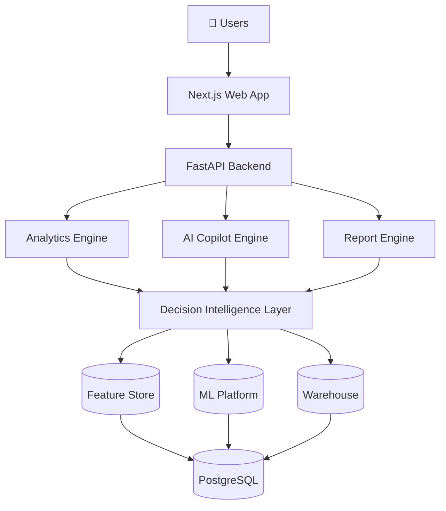
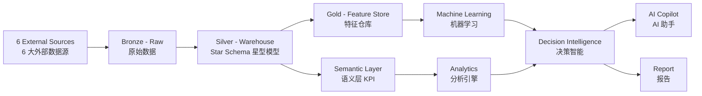
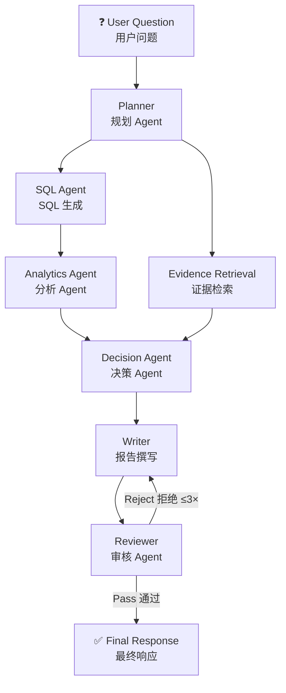

# InsightFlow

> **AI-Native Telecom Decision Intelligence Platform**
> **电信行业 AI 原生决策智能平台**

[](LICENSE)
[](https://www.python.org/)
[](https://fastapi.tiangolo.com/)
[](https://www.postgresql.org/)
[](https://www.langchain.com/langgraph)
[](https://shap.readthedocs.io/)
[]()
[]()

---

InsightFlow transforms telecom operational data into **evidence-driven decisions**. It is not another dashboard — it is an AI-native platform built on a single analytical pipeline:

InsightFlow 将电信运营数据转化为**有证据支撑的经营决策**。它不是又一个仪表盘，而是基于统一分析管线的 AI 原生平台：

```
Data → Insight → Evidence → Recommendation → Decision → Report
```

It answers questions traditional BI cannot:

它回答传统 BI 无法回答的问题：

| Traditional BI 传统 BI | InsightFlow |
|:-----------------------|:-------------|
| What happened? 发生了什么？ | **Why did it happen?** 为什么发生？ |
| How many users churned? 流失了多少用户？ | **Who will churn next?** 谁将流失？ |
| What is the ARPU? ARPU 是多少？ | **What should we do?** 应该做什么？ |
| (no proof) 无证据支撑 | **What evidence supports this?** 证据是什么？ |

---

## ✨ Why InsightFlow — 为什么选择 InsightFlow

| Feature 能力 | Traditional BI 传统 BI | InsightFlow |
|:------------|:----------------------|:-------------|
| Analysis depth 分析深度 | Descriptive 描述性 | **Prescriptive + Predictive** 预测性 + 处方性 |
| Explainability 可解释性 | None 无 | **SHAP factors per prediction** 每次预测附 SHAP 因素 |
| Evidence 证据 | Numbers without proof 无证据的数字 | **SQL + sample size + confidence** 可复现证据 |
| User interface 交互 | Dashboard 仪表盘 | **Natural language Copilot** 自然语言助手 |
| Report 报告 | Manual 手工 | **Auto-generated executive reports** 自动生成 |
| Decision support 决策支持 | Data display 数据展示 | **Ranked recommendations** 排序建议 |

---

## 🚀 Core Features — 核心能力

| Module 模块 | Description 描述 | Status 状态 |
|:-----------|:-----------------|:-----------|
| 👤 **Customer 360** | Unified customer profile across billing, usage, network, service & campaigns<br>跨账单/用量/网络/服务/营销的统一客户画像 | ✅ MVP |
| 📊 **KPI Analytics** | 50+ standardized telecom KPIs with trend & anomaly detection<br>50+ 个标准化电信 KPI，支持趋势与异常检测 | ✅ MVP |
| 🎯 **Customer Segmentation** | Automatic clustering (KMeans / GMM)<br>自动客户分群（KMeans / GMM） | ✅ MVP |
| ⚠️ **Churn Prediction** | 5 benchmarked models with SHAP explainability<br>5 个基准模型 + SHAP 可解释性 | ✅ MVP |
| 🧠 **Decision Intelligence** | Every output follows Finding → Evidence → Impact → Recommendation → Confidence<br>每个输出遵循 发现 → 证据 → 影响 → 建议 → 置信度 | ✅ MVP |
| 🤖 **AI Copilot** | 7-agent natural language analytical workflow<br>7-Agent 自然语言分析工作流 | 🔜 Sprint 3 |
| 📄 **Report Generator** | Auto executive reports (Markdown / PDF)<br>自动生成管理层报告（Markdown / PDF） | 🔜 Sprint 3 |

---

## 🏗️ Architecture — 系统架构

### System Context 系统上下文



### Data Pipeline 数据管线



### AI Copilot — 7-Agent Workflow



---

## 🛠️ Tech Stack — 技术栈

| Layer 层 | Technology 技术 | Purpose 用途 |
|:---------|:----------------|:-------------|
| **Frontend** | Next.js 15, TypeScript, Tailwind, ECharts, TanStack Query | Dashboard, Copilot UI, Reports |
| **Backend** | FastAPI, Python 3.12, SQLAlchemy 2.0, Pydantic v2 | REST API, Clean Architecture |
| **Data** | PostgreSQL 16, DuckDB, Alembic | Bronze/Silver/Gold + Semantic layer |
| **ML** | scikit-learn, XGBoost, LightGBM, CatBoost, SHAP, joblib | Churn prediction, explainability |
| **AI** | LangGraph, LLM (OpenAI-compatible) | 7-agent orchestration |
| **Infra** | Docker, Redis, MinIO, GitHub Actions | Dev environment, caching, CI/CD |

---

## 📦 Quick Start — 快速开始

### Prerequisites 前置要求

| Tool 工具 | Version 版本 |
|:----------|:-------------|
| Docker | 28+ |
| Python | 3.12+ |
| uv | latest |

### 1. Start Infrastructure 启动基础设施

```bash
cd docker && docker compose up -d postgres redis
```

### 2. Bootstrap Backend 初始化后端

```bash
cd backend
cp .env.example .env
uv sync
uv run alembic upgrade head                    # 建表 migrations
uv run python scripts/seed_registries.py      # seed dim_time + 50 KPIs + 44 features
uv run python scripts/generate_mock_data.py --seed 42 --customers 1000   # 生成模拟数据
uv run python scripts/run_etl.py --input-dir data/mock                  # ETL → Star Schema
uv run python scripts/generate_features.py     # Feature Store
uv run python -m app.ml.deploy                 # 训练 + 注册 + 提升生产模型
```

### 3. Start Server 启动服务

```bash
uv run uvicorn app.main:app --port 8000
```

### 4. Verify 验证

```bash
# Health check 健康检查
curl http://localhost:8000/api/v1/system/health
# → {"success":true,"data":{"status":"healthy","checks":{"database":"ok"}},...}

# Churn prediction 流失预测（对已流失客户）
curl -X POST http://localhost:8000/api/v1/churn/predict \
  -H "Content-Type: application/json" \
  -d '{"customer_id":"CUST-00000002"}'
```

**Sample response 示例响应:**

```json
{
  "success": true,
  "data": {
    "customer_id": "CUST-00000002",
    "risk_score": 0.8773,
    "risk_level": "HIGH",
    "top_positive_factors": [
      {"feature": "avg_daily_data_mb", "contribution": 27.36, "feature_value": 0.0},
      {"feature": "arpu", "contribution": 14.26, "feature_value": 0.0}
    ],
    "confidence": 0.95,
    "model_version": "v20260814095333_55d3"
  }
}
```

---

## 📚 API Overview — API 概览

| Area 领域 | Endpoint 端点 | Description 描述 |
|:----------|:--------------|:-----------------|
| System | `GET /api/v1/system/health` | Health check 健康检查 |
| Analytics | `GET /api/v1/analytics/kpi` | KPI list with filters KPI 列表 |
| Analytics | `GET /api/v1/analytics/kpi/{metric}` | Metric trend 指标趋势 |
| Analytics | `GET /api/v1/analytics/anomaly` | Anomaly detection 异常检测 |
| Customers | `GET /api/v1/customers` | Paginated customer list 客户列表 |
| Customers | `GET /api/v1/customers/{id}` | Customer 360 profile 客户 360 画像 |
| Churn | `POST /api/v1/churn/predict` | Online prediction 在线预测 |
| Churn | `POST /api/v1/churn/predict/batch` | Batch prediction 批量预测 |

Full contract in [`05_API_SPEC.md`](05_API_SPEC.md) — 完整契约见 `05_API_SPEC.md`

---

## 📖 Documentation — 工程文档

The engineering contract is **frozen** before implementation — every decision is documented and machine-checkable:

工程契约在编码前**冻结**——每个决策都有文档记录且可被机器检查：

| Doc 文档 | Contents 内容 |
|:---------|:--------------|
| [`00_PROJECT_STRUCTURE.md`](00_PROJECT_STRUCTURE.md) | Repository map, import rules 目录结构与导入规则 |
| [`01_PRD.md`](01_PRD.md) | Product requirements 产品需求 |
| [`02_ARCHITECTURE.md`](02_ARCHITECTURE.md) | System architecture 系统架构 |
| [`03_DATABASE.md`](03_DATABASE.md) | Database design 数据库设计 |
| [`04_DATASET_SPEC.md`](04_DATASET_SPEC.md) | Input data contract 数据输入契约 |
| [`05_API_SPEC.md`](05_API_SPEC.md) | API contract API 契约 |
| [`06_FRONTEND.md`](06_FRONTEND.md) | Frontend component spec 前端组件规范 |
| [`07_AI_DESIGN.md`](07_AI_DESIGN.md) | AI agent design AI Agent 设计 |
| [`08_ARCHITECTURE_RULES.md`](08_ARCHITECTURE_RULES.md) | **Enforceable rules 可执行规则** (L0–L3) |
| [`09_CODING_RULES.md`](09_CODING_RULES.md) | Coding standards 编码规范 |
| [`10_DEVELOPMENT_PLAN.md`](10_DEVELOPMENT_PLAN.md) | Sprint plan Sprint 计划 |
| [`11_EVALUATION.md`](11_EVALUATION.md) | Evaluation framework 评估框架 |
| [`12_DEPLOYMENT.md`](12_DEPLOYMENT.md) | Deployment guide 部署指南 |
| [`14_TRACEABILITY_MATRIX.md`](14_TRACEABILITY_MATRIX.md) | PRD→API→DB traceability 需求追溯矩阵 |
| [`15_DECISION_TREE.md`](15_DECISION_TREE.md) | Code placement decision tree 代码放置决策树 |
| [`16_IMPLEMENTATION_CHECKLIST.md`](16_IMPLEMENTATION_CHECKLIST.md) | Sprint acceptance checklist 验收清单 |
| [`17_BASELINE.md`](17_BASELINE.md) | Project baseline tracking 基线追踪 |

---

## 🗺️ Roadmap — 路线图

| Version 版本 | Scope 范围 |
|:-------------|:-----------|
| **V1.0** (MVP) | Analytics, Customer 360, Churn Prediction, Reports 分析、客户 360、流失预测、报告 |
| **V1.5** | Recommendation Engine, What-if Simulation 推荐引擎、场景模拟 |
| **V2.0** | LLM Agent Workflow, Knowledge Graph, RAG 智能体工作流、知识图谱 |
| **V3.0** | Autonomous Decision Intelligence, Continuous Learning 自主决策智能、持续学习 |

---

## 🤝 Contributing — 贡献指南

1. Read [`08_ARCHITECTURE_RULES.md`](08_ARCHITECTURE_RULES.md) first — L0/L1 rules are enforced by CI.
   先阅读架构规则——L0/L1 规则由 CI 强制执行。
2. Check [`15_DECISION_TREE.md`](15_DECISION_TREE.md) before creating any file.
   创建任何文件前查阅决策树。
3. Run all gates locally before pushing:
   推送前在本地跑完全部门禁：
   ```bash
   cd backend
   uv run ruff check . && uv run mypy app/
   uv run python scripts/check_architecture.py
   uv run pytest tests/
   ```

---

## 📜 License

[MIT](LICENSE) © 2026 [runjie luo](https://github.com/DieRoger) (DieRoger)
